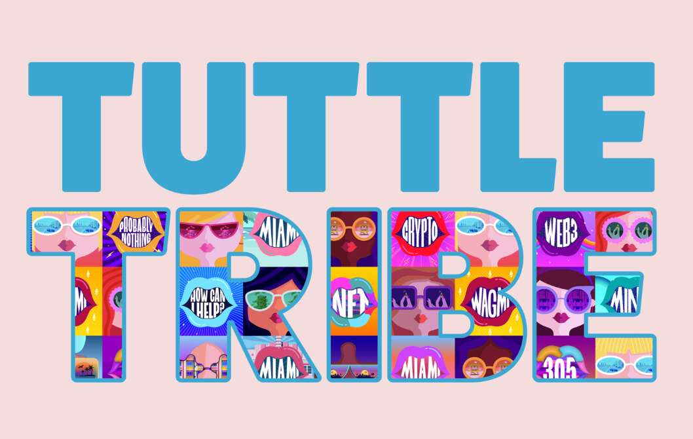

# Tuttle Tribe

Tuttle 部落是 3,050 个 NFT 的集合。为了向迈阿密的母亲 Julia Tuttle 致敬，我们向美国唯一一个由女性创建的主要城市致敬。NFT 作为 Web3 Equity 教育社区的会员通行证，包括免费的 IRL + 虚拟学习、会议折扣、编码训练营、学院等。我们通过增加知识并为女性投资者、收藏家和创作者提供网络和资源来追求 web3 中的性别平等。“这可能看起来很奇怪，但看到这片荒野变成一个繁荣的国家是我一生的梦想……就像太阳升起和落下一样，这一切肯定会实现。”

——朱莉娅·塔特尔

