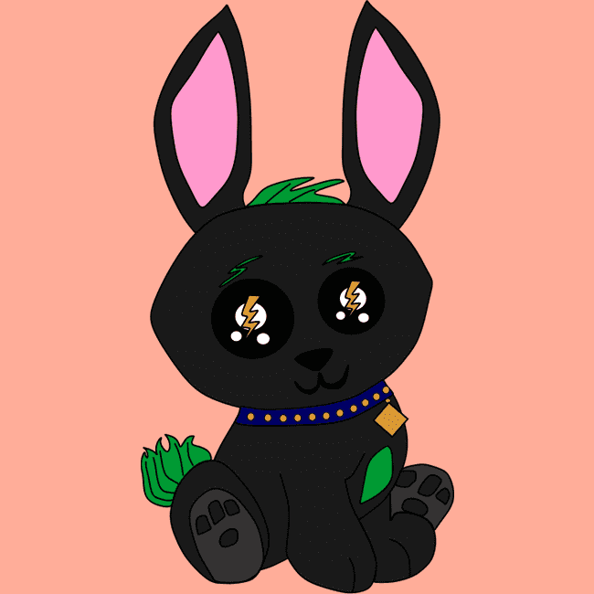

# UEHSLightningBunniPups

UEHS Lightning Bunni Pups 由 3572 只独特的手绘兔子幼崽组成。 我们所有的项目都为内城青年的康复提供资金。 拯救未来由我们来决定！定价 每只兔子小狗的价格为 .0099 ETH Perks，按 tiers1 Bunni Pups 获得 WL（质押状态（1）.12ETH 铸币），2 只兔子小狗获得终身 WL（质押状态（2）。 11ETH mint），3 Bunni Pups 获得终身 WL，（承诺状态（3）.09ETH mint），Pledge Bunni Pups 独家连帽衫每一层都带有会员只能访问的不和谐。 它的成员只是为了我们社区的安全。内部 UEHS 团队的创造者。

Lightning Bunny PupsUEHS Bunni Pups 是您即将到来的精灵的伴侣。 Bunni Pups 拥有闪电等力量。 丑精灵隐藏社会宇宙有几个动物掉落，这是第一滴。 在即将举行的活动中，兔尼幼犬的持有者将比那些没有的人更有优势。

