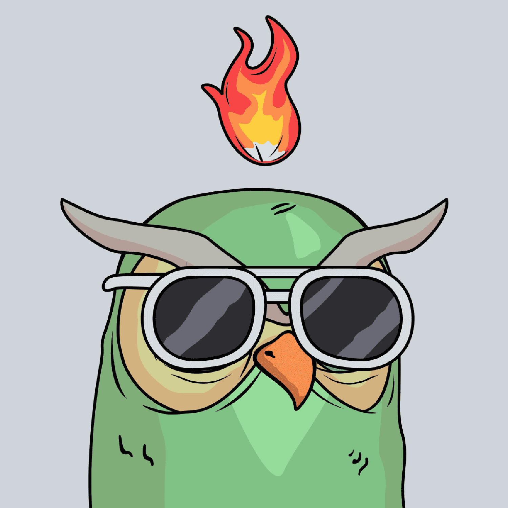

# Ugly Birdz.wtf

我们这么丑的原因是我们早餐吃地精。 免费加入丑陋的鸟巢🦉🌲🔔

什么是丑陋的 Birdz.wtf？
Ugly Birdz.wtf 是一个 NFT（Non-fungible token）集合。 存储在区块链上的数字艺术品集合。
▶ 有多少 Ugly Birdz.wtf 代币？
总共有 1,501 个 Ugly Birdz.wtf NFT。 目前，321 位所有者的钱包中至少有一个 Ugly Birdz.wtf NTF。
▶ 什么是最昂贵的 Ugly Birdz.wtf 销售？
售出的最昂贵的 Ugly Birdz.wtf NFT 是 Ugly Birdz #73。 它于 2022-06-07（3 个月前）以 7.3 美元的价格售出。
▶ 最近卖了多少Ugly Birdz.wtf？
过去 30 天内售出了 18 个 Ugly Birdz.wtf NFT。
▶ Ugly Birdz.wtf 需要多少钱？
过去 30 天，最便宜的 Ugly Birdz.wtf NFT 销售额低于 2 美元，最高销售额超过 18 美元。 过去 30 天内，Ugly Birdz.wtf NFT 的中位价格为 9 美元。
▶ 什么是流行的 Ugly Birdz.wtf 替代品？
许多拥有 Ugly Birdz.wtf NFT 的用户还拥有 Fart off、BloodyApeFromHell、888 Inner Circle - Pink Realm 和 Ape By AI。

