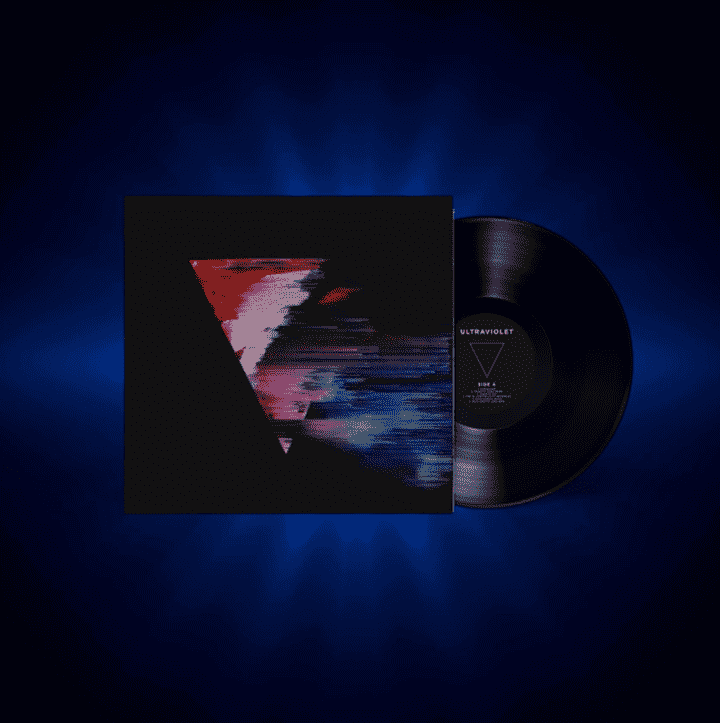

# Ultraviolet Vinyl Collection by 3LAU

3LAU 的 Ultraviolet Vinyl Collection 庆祝他在 2018 年发行的首张专辑 3 周年，迄今已获得超过 1 亿的流媒体播放量。 这张专辑捕捉到了数字驱动的社会关系不可避免的孤独感，而原始艺术品是由 3LAU 的长期创意合作伙伴 Slimesunday 设计的。 Slimesunday 使用像素排序等编辑技术在视觉上表现这一主题，捕捉情感衰退，以及在数字世界和模拟世界之间寻找平衡的努力。 这种感觉在 2021 年尤为重要。

有史以来第一次，代表最畅销专辑的NFT系列正在拍卖。3LAU已经打破了10亿的在线流，并正在发布这些千载难逢的NFT，以纪念他的专辑Ultraviolet的3年发行。只有33种紫外线乙烯基NFT将被铸造。

