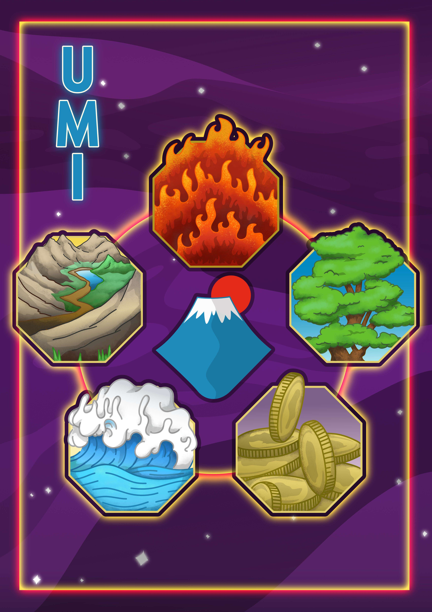

# UMI Digital

Umi DeFi NFT Collection 提供各种 NFT，可以与基于 Ethereum、Sora、Polkadot、Matic 和 Binance 智能链的 Umi Digital DeFi Farming dapp 中的其他加密资产一起质押。

一个分散的跨链NFT和元界项目，建立在Sora（XOR），Polkadot（DOT），以太坊（ETH），币安智能链（BSC）和Polygon（MATIC）区块链上

专注于NFT的开发和效用及其在元界（亲切地称为UMIVERSE）和分散金融（NFT农业）中的创新用途和应用。

UMI是Umi Digital Metaverse的效用和治理令牌。它促进了链上治理机制，例如提出公投，投票等，或激励艺术家并推动创建产生独特收益的NFT。

