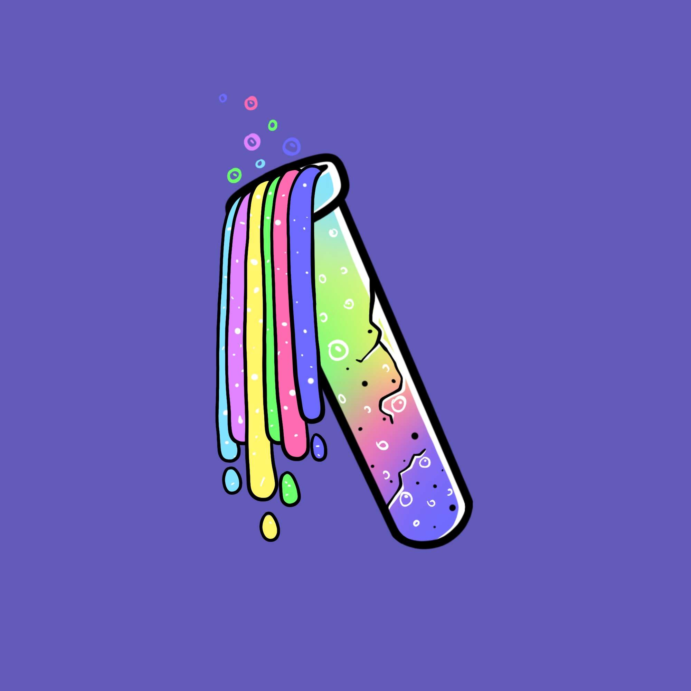

# Undead Elixirs

Undead Elixirs 是一组用于将 Undead Pastel Club NFT 变异为 Mutant Pastel Club NFT 的长生不老药。 该系列分为三个不同的等级：E1、E2 和 Mega 等级。

不死粉彩俱乐部
不死粉彩俱乐部是9，999只粉彩猿类的衍生NFT集合，以社区为重点。每个NFT都是使用140多种属性的组合（例如帽子，眼睛，皮肤等）通过算法生成的！

在以太坊（ETH）区块链上推出的Undead Pastel俱乐部旨在以合理的价格提供高质量的艺术品，同时执行广泛的路线图。凭借质押功能和元界土地收购作为我们路线图的关键部分，Undead Pastel Club团队致力于保持持久性。

社区基金的实施还将允许支付未来的营销费用，这意味着即使收藏品售罄，该项目仍将引起公众的关注。

立即加入我们的Discord社区，有机会加入白名单！

