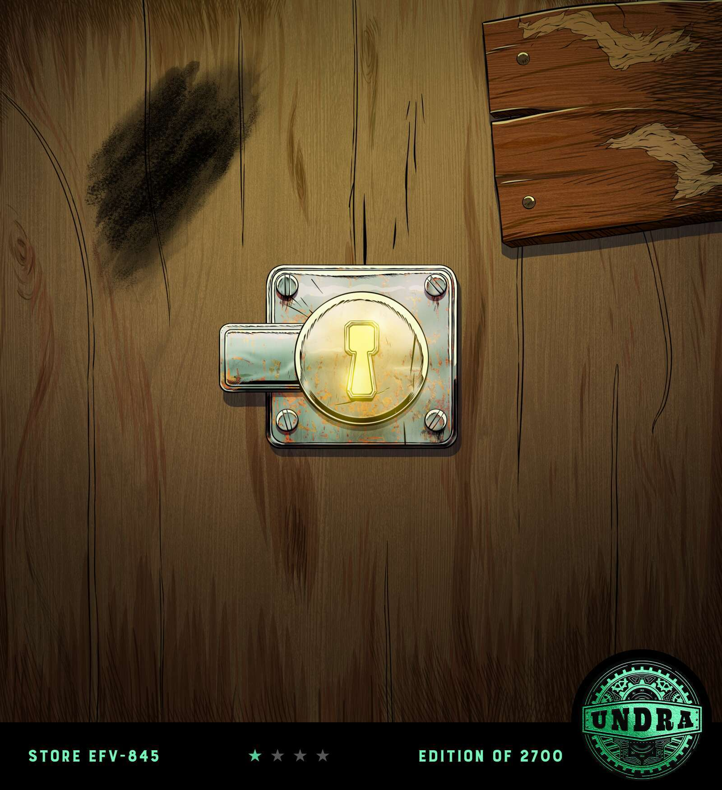

# Undra.game

Undra 是一款基于战略和协作的 MMO，社区的行动和选择以深远而永久的方式塑造着世界。

这一年是1898年。来自全球最伟大的工业头脑正在竞相夺取他们的一块Undra - 一块新发现的土地，具有巨大的未开发潜力......

Undra是一个基于战略和协作的MMO，其中社区的行动和选择以深刻和永久的方式塑造了世界。

Undra的分阶段发布意味着将定期添加新的游戏层次，从而大大增加每期玩家可用的选项。下一个版本侧重于治理。

这个过程将最终以实时合作任务的发布而告终，呼吁玩家进入Undra的深处，共同努力保护资源，与地下野生动物作战，并恢复违禁文物。

