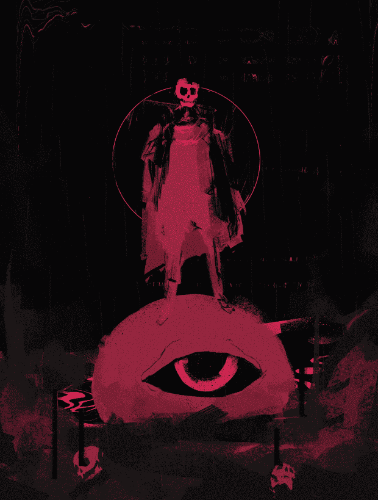

# UNDRWRLD by Zenoyis

欢迎来到冥界。

Zenoyis 的 UNDRWRLD 是什么？
Zenoyis 的 UNDRWRLD 是一个 NFT（不可替代令牌）集合。存储在区块链上的数字艺术品集合。
▶ Zenoyis 代币的UNDRWRLD 有多少？
Zenoyis NFT 总共有 9 个 UNDRWRLD。目前，113 位所有者的钱包中至少有一个 Zenoyis NTF 的 UNDRWRLD。
▶ Zenoyis 出售的最昂贵的 UNDRWRLD 是什么？
Zenoyis NFT 出售的最昂贵的 UNDRWRLD 是 UNDRWRLD TICKET #1。它于 2022 年 6 月 7 日（3 个月前）以 270 美元的价格售出。
▶ Zenoyis 最近卖出了多少 UNDRWRLD？
Zenoyis NFT 在过去 30 天内售出 44 个 UNDRWRLD。
▶ Zenoyis 的 UNDRWRLD 费用是多少？
在过去的 30 天里，Zenoyis NFT 的 UNDRWRLD 最便宜的销售额低于 98 美元，最高销售额超过 940 美元。 Zenoyis NFT 的 UNDRWRLD 的中位价格在过去 30 天内为 132 美元。
▶ Zenoyis 流行的 UNDRWRLD 替代品有哪些？
许多拥有 Zenoyis NFT 的 UNDRWRLD 的用户还拥有 Stranger Days、Zanoza Art Bank、STEP BY STEP 8bit 和 P.S.我爱你。

