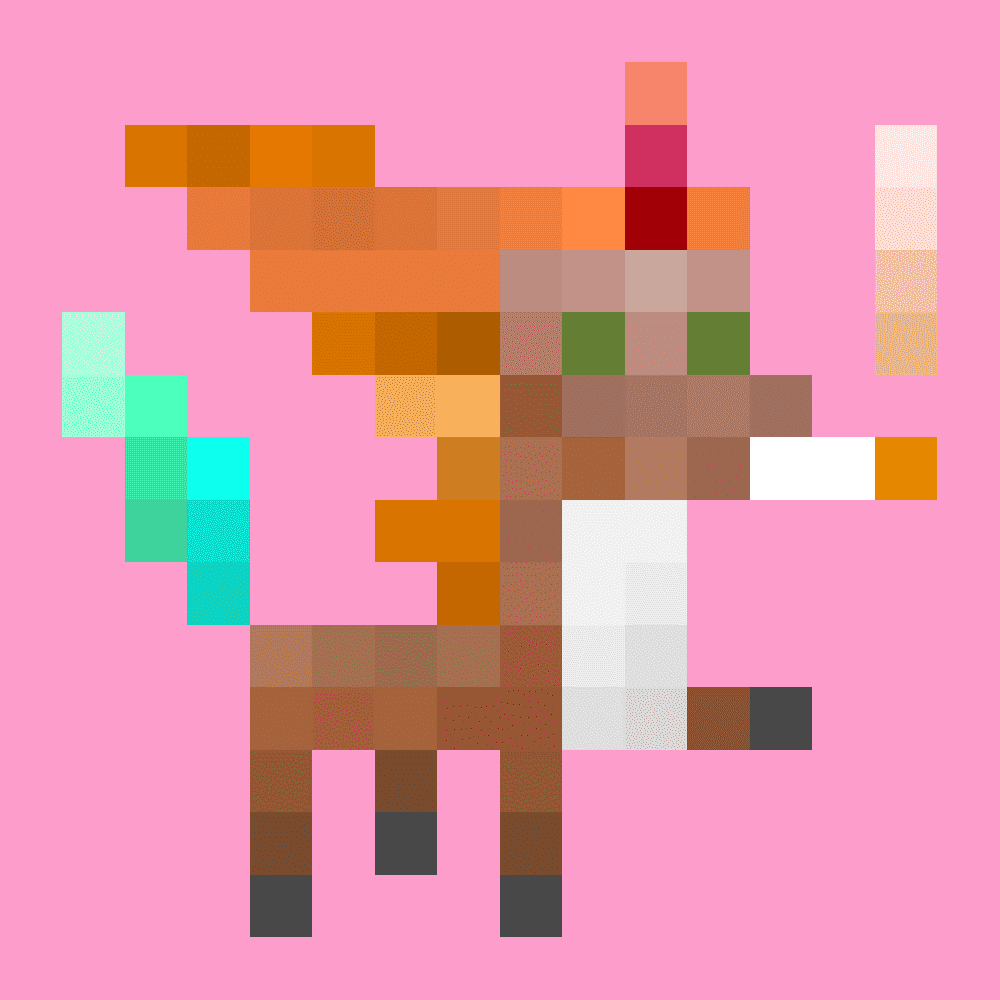

# Unicorn Mantra

以太坊区块链上的1111独角兽咒腾跃| CC0因为我们都是独特而神奇的。

Unicorn Mantra NFT - 常见问题（FAQ）
▶ 什么是独角兽咒？
Unicorn Mantra 是一个 NFT（不可替代代币）集合。 存储在区块链上的数字艺术品集合。
▶ Unicorn Mantra 代币有多少？
总共有 1,111 个 Unicorn Mantra NFT。 目前，592 位所有者的钱包中至少有一个 Unicorn Mantra NTF。
▶ 最近卖出了多少独角兽咒？
过去 30 天内售出 0 个 Unicorn Mantra NFT。
▶ 什么是流行的 Unicorn Mantra 替代品？
许多拥有 Unicorn Mantra NFT 的用户还拥有 Lil Lazy、EL NUMEROS、DegenOkayBears 和 WaterBe4nZuki。

