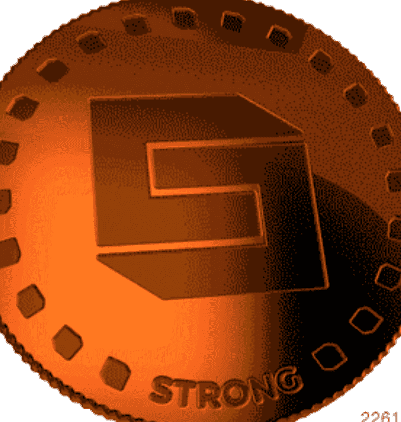

# StrongBlock NFTs

StrongBlock 集合中的第一个 NFT 条目是青铜。 未来的参赛作品将包括银牌、金牌和铂金。

StrongBlock NFT 的总销售额为 2.05 万美元。 一个 StrongBlock NFT NFT 的平均价格为 186.1 美元。 有 1,933 名 StrongBlock NFT 所有者，总共拥有 5,182 个代币。

什么是 StrongBlock NFT？
StrongBlock NFTs 是一个 NFT（非同质代币）集合。存储在区块链上的数字艺术品集合。
▶ 存在多少 StrongBlock NFT 代币？
总共有 5,182 个 StrongBlock NFT NFT。目前 1,933 位所有者的钱包中至少有一个 StrongBlock NFTs NTF。
▶ 最昂贵的 StrongBlock NFT 销售是什么？
最昂贵的 StrongBlock NFT NFT 是 STRONG PLATINUM #72。它于 2022 年 8 月 9 日（23 天前）以 240 美元的价格售出。
▶ 最近卖出了多少 StrongBlock NFT？
过去 30 天内售出了 29 个 StrongBlock NFT NFT。
▶ StrongBlock NFT 的成本是多少？
过去 30 天，StrongBlock NFT 最便宜的 NFT 销售额低于 19 美元，最高销售额超过 661 美元。过去 30 天内，StrongBlock NFTs NFT 的中位价格为 84 美元。
▶ 流行的 StrongBlock NFT 替代品有哪些？
许多拥有 StrongBlock NFTs NFTs 的用户还拥有 BeaNFT Genesis、Midnite Wolf Pack、Rarible Fresh Drip Merch 和 Summer Festival Fits。

