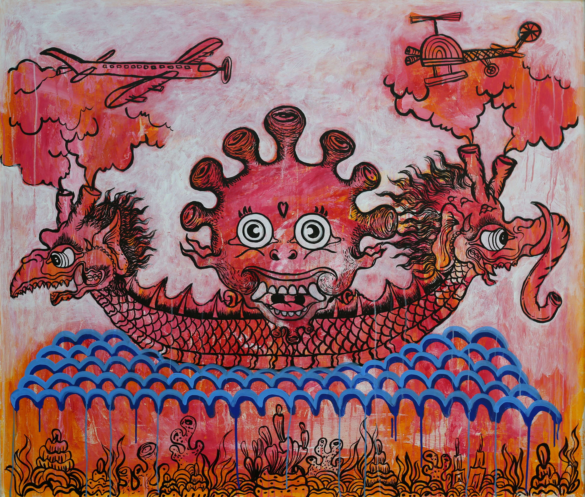

# Mural Fest 2022

壁画节是一个支持社会影响倡议的艺术和文化节。 我们利用艺术、音乐、电影和技术作为催化剂，为非政府组织筹集资金、促进当地经济发展以及发展我们的艺术、技术和文化社区。2022 年我们的节日将在印度尼西亚巴厘岛举行。 在这里，我们将从 7 月到 11 月创建壁画，通过从 2022 年巴厘岛壁画节期间创建的公共艺术项目中铸造 NFT 收藏品，为高影响力倡议和非政府组织开发资助模型。

