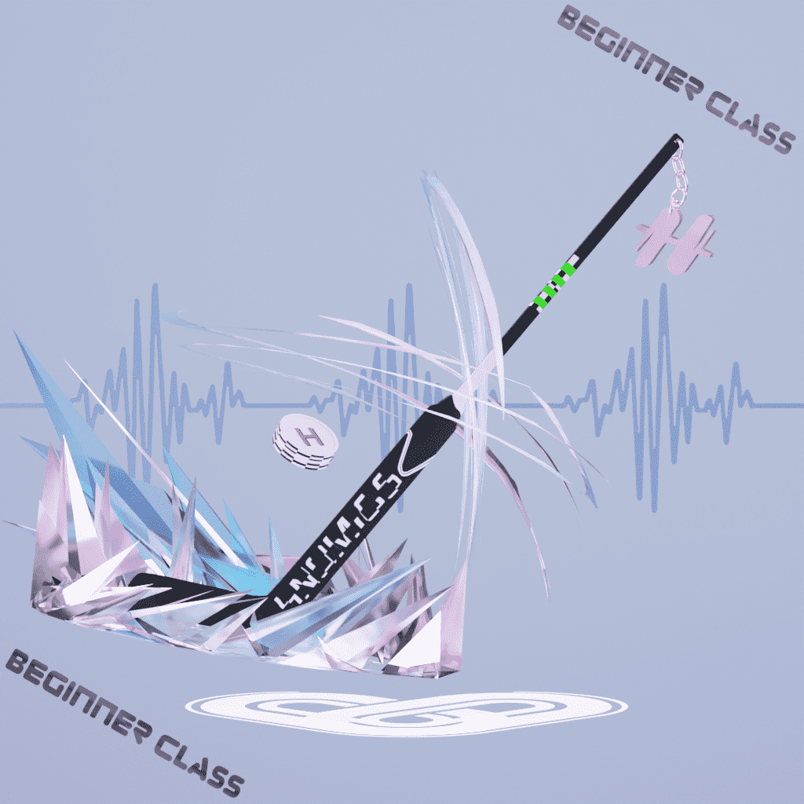

# Hnomics

Hnomics 项目与 Health 和 Economics 相结合，是一个在室内外运动或日常生活中根据心率进行奖励的项目，是一个 H2E（Heart beats to Earn）系统，以四种独特的 NFT 模型进行奖励。

荣誉项目H2E 的 NFT 项目，可在室内/室外非有限空间内根据锻炼或
日常心率水平获得健康奖励。

通过拥有荣誉NFT发布荣誉应用程序之前

拥有您自己的 NFT，加入社区并参与活动！

NFT 型号有四种代表性的运动鞋、球拍、棍棒和头盔，

每个模型分为四个级别。

