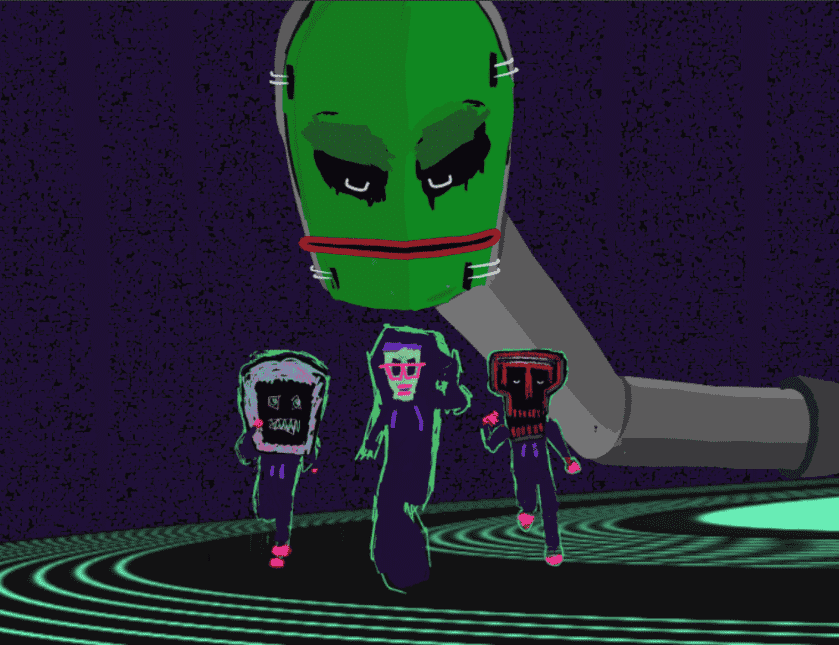

# Wronguns

Wronguns 是来自 Everyday Strange 收藏的可疑人物 Wrongun 代币持有者将收到艺术空投和独特角色艺术品版本的抽奖活动。

什么是错误的？
Wronguns 是一个 NFT（非同质代币）集合。 存储在区块链上的数字艺术品集合。
▶ 有多少个 Wronguns 代币？
总共有 22 个 Wronguns NFT。 目前，136 位所有者的钱包中至少有一个 Wronguns NTF。
▶ Wronguns 最昂贵的销售是什么？
最昂贵的 Wronguns NFT 是 Wrongun Token。 它于 2022 年 6 月 5 日（3 个月前）以 140 美元的价格售出。
▶ 最近卖出了多少 Wrongun？
过去 30 天内售出了 15 个 Wronguns NFT。
▶ Wronguns 的价格是多少？
在过去 30 天里，最便宜的 Wronguns NFT 销售额低于 43 美元，最高销售额超过 755 美元。 在过去 30 天内，Wronguns NFT 的中位价格为 67 美元。
▶ 什么是流行的 Wronguns 替代品？
许多拥有 Wronguns NFT 的用户还拥有 Strange Editions V2、LICENSE TO SHILL、SOCIATY66 和 JPEGs Dealer。

