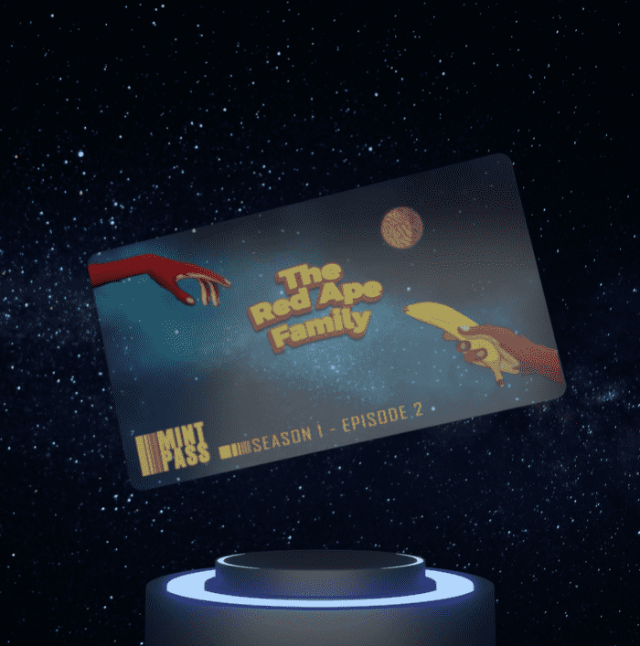

# TRAF Episode 2 Mint Pass

这是红猿家族标志性的 NFT 预约系统。 一张 Mint Pass 可让您在公开发售前以折扣价购买下一集的 NFT。 薄荷通行证仅在上一集公开后的 7 天内有效。

TRAF 第 2 集 Mint Pass NFT - 常见问题 (FAQ)
▶ 什么是 TRAF 第 2 集薄荷通行证？
TRAF Episode 2 Mint Pass 是一个 NFT（非同质代币）集合。 存储在区块链上的数字艺术品集合。
▶ 有多少 TRAF Episode 2 Mint Pass 代币？
总共有 1 TRAF Episode 2 Mint Pass NFT。 目前，130 位所有者的钱包中至少有一个 TRAF Episode 2 Mint Pass NTF。
▶ TRAF Episode 2 Mint Pass 最近卖出了多少张？
过去 30 天内售出了 0 个 TRAF 第 2 集 Mint Pass NFT。

