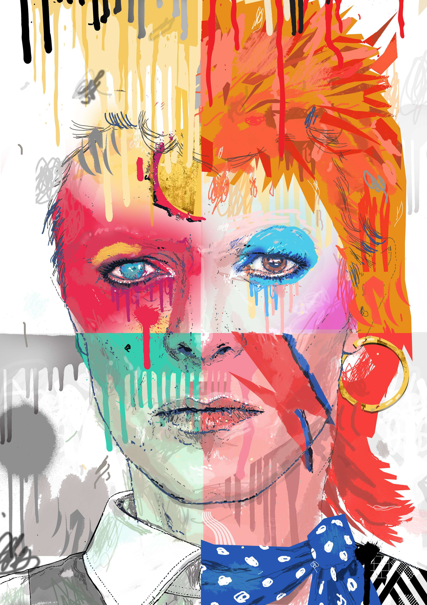

# ZAM II

为从 2022 年 3 月开始铸造的作品创建的新系列，现在永久存储在 Arweave 上，并由 Manifold 根据我自己的定制合同创建。

大卫鲍伊（1947 - 2016）被认为是二十世纪最伟大和最多产的音乐偶像之一，其歌手、词曲作者和演员的职业生涯跨越了 50 多年。 作为一名真正的艺人，他在艺术/设计学校接受过培训，他一直在尝试自己的作品和形象。 几十年来，他不断地改造自己，并在戏剧性的阶段呈现出各种各样的完全成型的角色，例如华丽的阿拉丁·萨内、Ziggy Stardust 或可怕的怪物； 瘦身和朴素的 Thin White Duke 时期或“Let's Dance”流行时期保守的衣冠楚楚的宽男孩外观。 一个看似无穷无尽的创意想法的人，我在一张肖像中展示了其中的一些。

