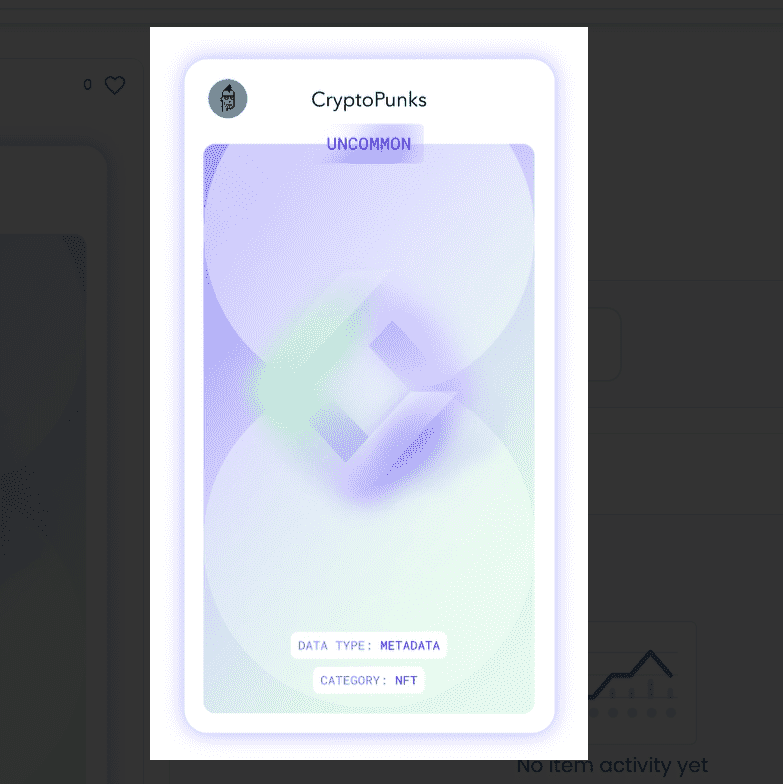

# DIA ART - CP

欢迎来到 DIA ART - OpenSea 上的 Crypto Punks 之家。 发现这个系列中最好的项目。

DIA正在创建数据基础设施，以实现协调，互连的元宇宙。

什么是自主权利令牌？
区块链技术为利用NFT和分散的二级市场实现数据权利管理提供了独特的机会。通过DIA的自治权利令牌，可以实现自主跟踪，执行和货币化。

分散式权限管理
使用 NFT 存储、跟踪和实施数据权利可实现完全分散的许可证生命周期管理，从创建到分发再到跟踪和货币化。

数据源可以声明和管理“源 ARTs”（sART）。sART 定义了“数据 ARTs”（dART） 的参数。想要使用DIA数据预言机的智能合约将被要求在合约中持有dART，他们可以自主铸造。

