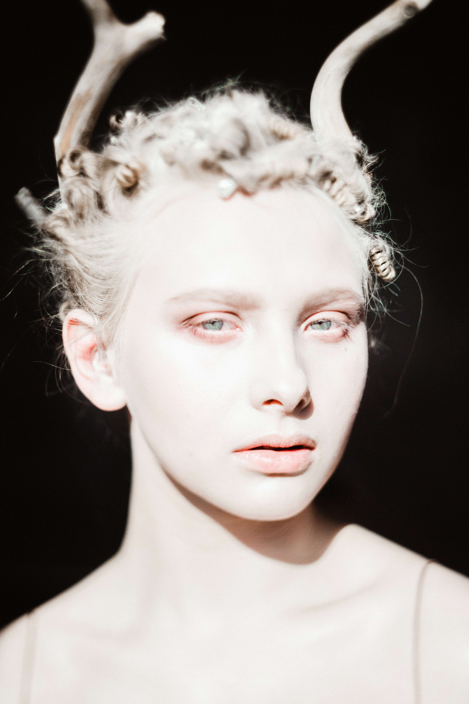

# SOKOVA editions

长片
故事片《切卡戈》的官方预告片

导演：尼科维·雷布尼科夫

DOP：卡特琳娜·索科娃

Svoboda 媒体制作

 这是一部犯罪剧，讲述了西伯利亚的贪婪交通和参与其中的 4 个朋友。
摄影师

DOP

摄影师

NFT 艺术家

 在圣彼得堡、莫斯科、欧洲、世界各地拍摄！
长片切卡戈
故事片 Checago 于 2021 年 9 月在西伯利亚拍摄，一部犯罪剧将于 2023 年出现在电影中。这里是拍摄的后台。

经过 
索科娃
“生活中，每一分钟都充满着奇迹和永恒的青春。”
@阿尔伯特加缪

和Arina一起拍摄了不同风格的照片。
她是一个几乎没有听力的年轻天才女孩，她从事舞蹈

