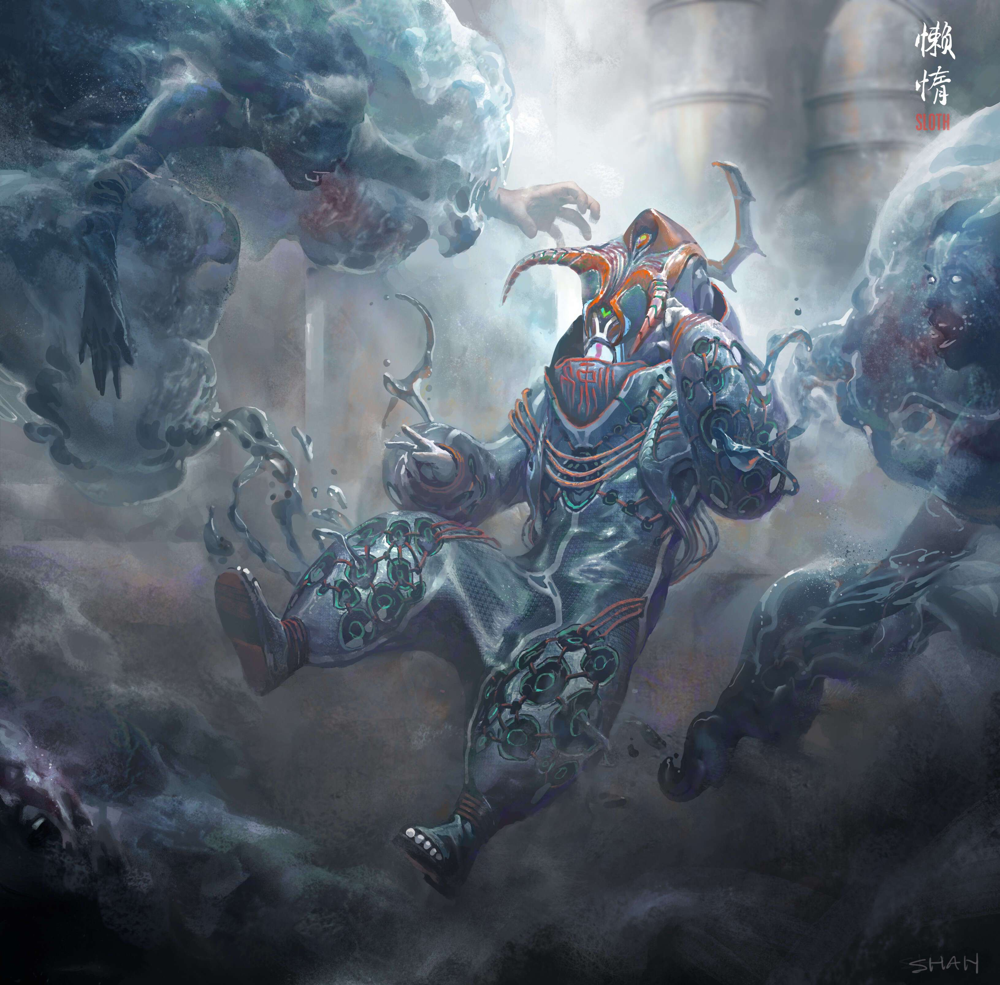

# FM Gallery

FM 画廊统计
创建于 1 年多前
81代币供应
OpenSea 验证集合
5% 费用
FM Gallery NFT 在过去 7 天内售出 1 次。FM Gallery 的总销售额为 0.14 美元。一个 FM Gallery NFT 的平均价格为 0.1 美元。共有 286 位 FM Gallery 所有者，总共拥有 81 个代币。

FM Gallery 是一个基于区块链的 NFT 艺术品分发平台。我们努力通过创新的艺术片段和自主的粉丝社区来赋予艺术和时尚界的力量。借助区块链技术，一件艺术品可以被分割成几个片段。每个以 NFT 为代表的片段都包含一个独特的艺术故事。通过收集碎片，用户可以完成艺术品并将完成的 NFT 兑换为实物艺术品。与世界各地的顶级艺术家、画廊和拍卖行合作，我们将继续在我们的区块链上发布物理和虚拟加密艺术品。

