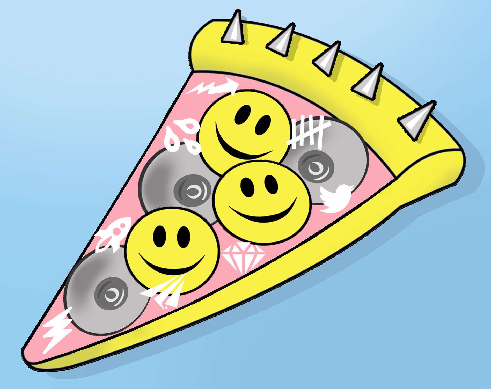

# CryptoMemes by ZAM

如果 Lambie 是一片披萨，它的味道会如何？就像我认为的美好时光。另一个对澳大利亚加密艺术家 Lambie 才华的致敬，灵感来自这位艺术家在 2022 年 1 月下旬在社交媒体上发布的一张自拍照，在早餐时吃掉了一些粘糊糊的意大利美食
。她以色彩缤纷的艺术和挑衅但永远欢快的性格而闻名。这种独特的平衡使她成为一个受欢迎的人物，因为她不断引用加密文化空间，并通过无情的社交媒体传播每天对其进行翻译；总是结合她当前标志性调色板的元素（黄色、粉红色、淡蓝色），并伴随着使用经常使用的图标，如香蕉、笑脸、猿、鲣鸟、驴和比萨饼（例如）。

永久存储在 Arweave 上，根据 Manifold 定制合同铸造。

