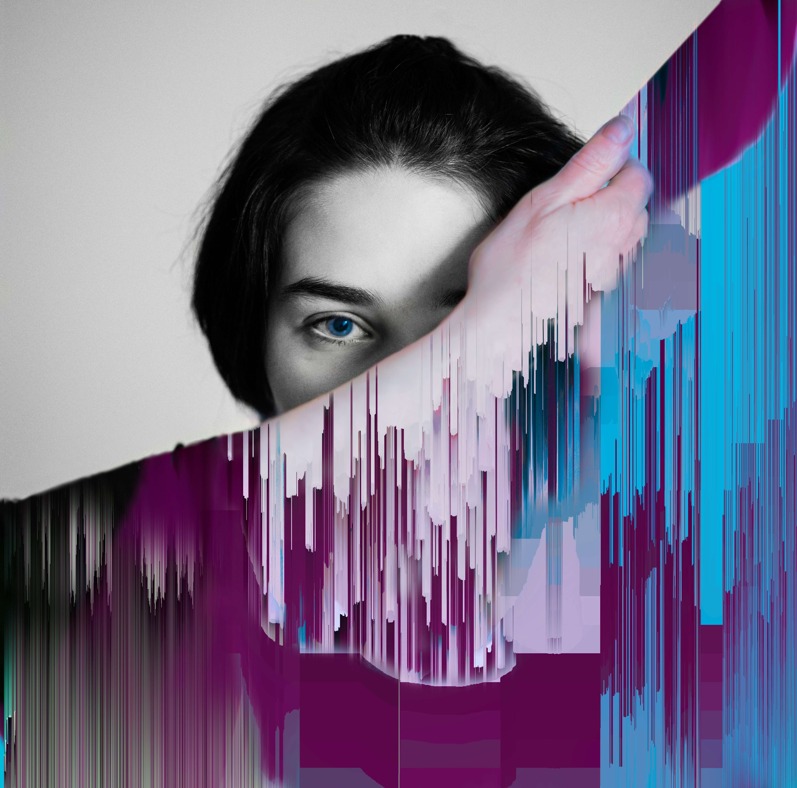

# Editions by Meanderquest and Alexander

这一切都始于一个真实的故事。Supriya (Sup) 和 Sameer (Sam) 在 30 多岁时开始摄影，当时 Sup 正与临床抑郁症作斗争。这是一段痛苦的旅程，被嘲笑、被亲人孤立、自恨到她试图结束自己的生命。于是，为了放松对精神障碍的束缚，两人开始前往遥远的地方，在那里她在大自然中找到了自己的慰藉。对摄影、旅行和彼此的爱相结合，挽救了她的生命。

因此，摄影不仅是他们的愿景，也是他们如何找到勇气与孤立、精神痛苦、社会规范作斗争并在所有困难中生存下来的深刻艺术表达。

这个集合是一系列 10 幅图像（每幅图像是 1/1），拍摄于欧洲美丽的风景，然后由 Sup 进行像素化和分类。这些艺术形象反映了人类生活对每一个决定的反省和对活着的微弱希望。

