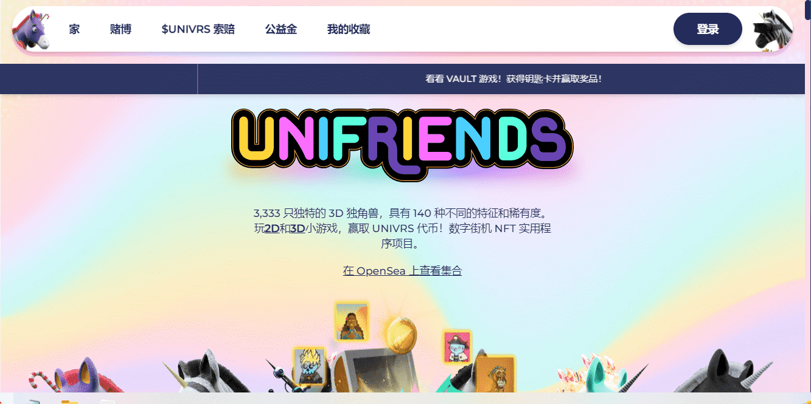

# Unifriends NFT Official

3,333 个生成独角兽 NFT
140 种独特特征，包括皮肤、头发、角、可穿戴设备、物品、背景和眼镜的变化！
10 个在游戏中具有特殊能力的传奇 1/1 Unifriends。
链上元数据决定了你的独角兽是快速、强大还是智能。当铸币发生时，链上属性是使用伪随机化方法动态得出的。3,333 只独特的 3D 独角兽，具有 140 种不同的特征和稀有度。玩2D和3D小游戏，赢取 UNIVRS 代币！数字街机 NFT 实用程序项目。
公益金是一个面向实用程序的 NFT 基金，用于在 Unifriends 社区内发展游戏生态系统。公益金将能够基于拥有 UNIVRS 代币提取 NFT 资产。想象一下，在玩游戏并获得足够的 UNIVRS 代币后，可以提取蓝筹 NFT。社区基金中的 NFT 将根据 DAO 投票购买。

