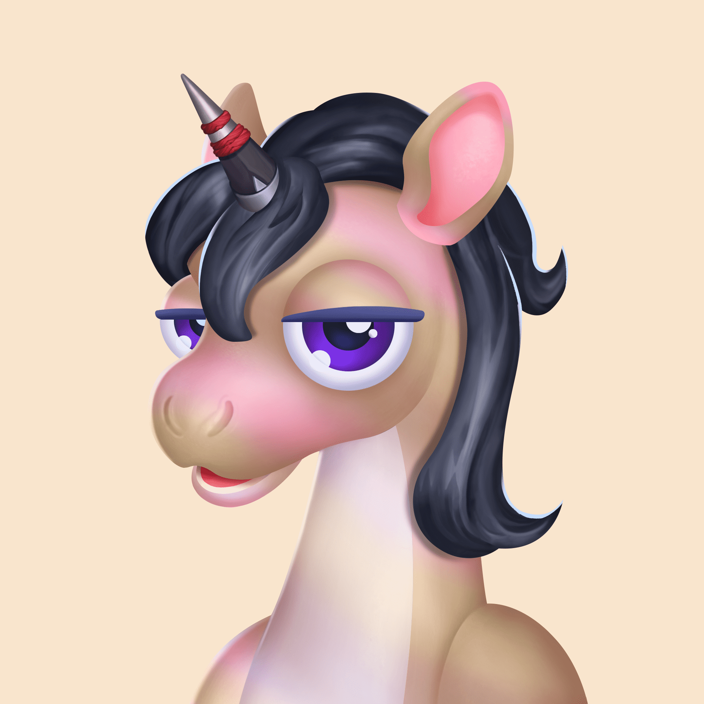

# UninterestedUnicornsV2

神奇可爱变得无聊，所以独角兽们开始努力为他们的生活带来兴奋。但过了一会儿，这还不够，所以现在他们只是无趣和厌烦，将自己孤立在大峡谷中。

独角兽社会分为不同的氏族，每个氏族都在一个领域中占据主导地位：火、水、空气和土。正如他们所预料的那样，对生命元素的这种垄断导致了氏族之间的摩擦，并很快引发了战争。

曾经带来激情、技巧和回报的东西，现在被快速判断的一瞥和耸耸肩。事实上，独角兽们已经将自己隐藏在大山谷中，在那里他们可以自由地做他们不感兴趣的自己，而不会受到元宇宙其他成员的抱怨。

为什么要为基本的事情烦恼，对吧？尽管如此，每个氏族都过着自己的生活，对元宇宙中发生的事件完全麻木。
也就是说，除非最终发生看似有趣的事情。

