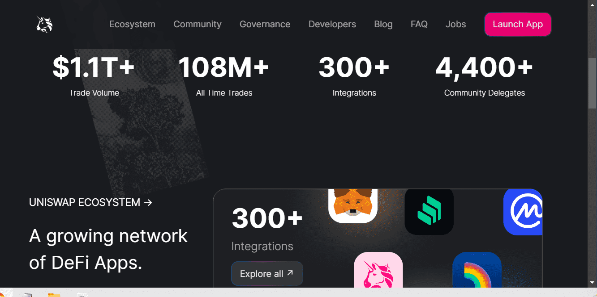

# Uniswap V3 Positions

什么是 Uniswap 协议？
Uniswap 协议是一种开源协议，用于在以太坊上提供流动性和交易 ERC20 代币。它消除了受信任的中介机构和不必要的租金提取形式，从而实现了安全、可访问和高效的交换活动。该协议是不可升级的，旨在抗审查。

Uniswap 协议和 Uniswap 接口由 Uniswap 实验室开发。
Uniswap 协议如何工作？
Uniswap 是一家自动化做市商。实际上，它是一组智能合约，定义了创建流动性池、提供流动性和交换资产的标准方法。

每个流动性池包含两种资产。池跟踪总流动性储备和流动性提供者设定的预定义定价策略。每次有人交易时，储备金和价格都会自动更新。没有中央订单簿，没有第三方托管，也没有私人订单撮合引擎。

由于每次交易后储备金会自动重新平衡，因此 Uniswap 池始终可用于买卖代币——与传统交易所不同，交易者无需匹配单个交易对手即可完成交易。

