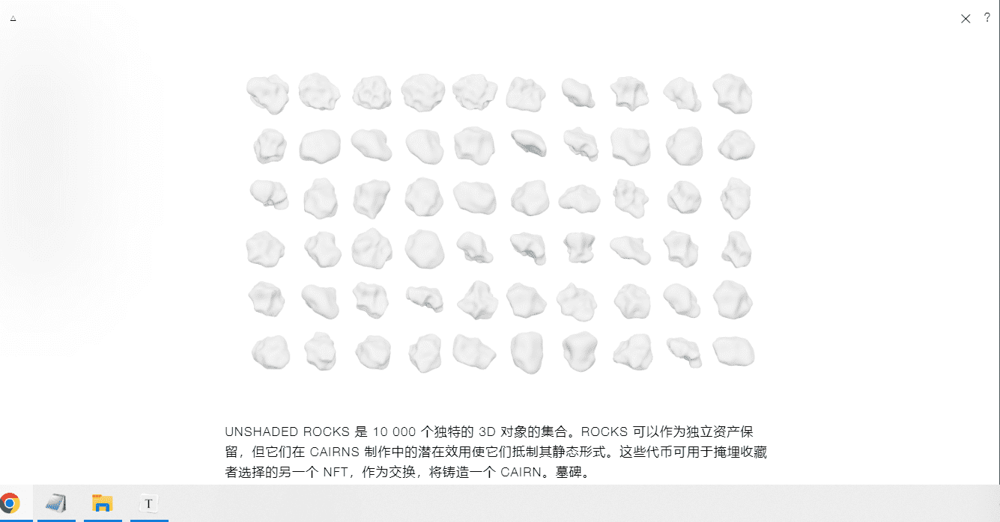

# UNSHADED ROCKS

UNSHADED ROCKS 是 10 000 个独特的 3D 对象的集合。ROCKS 可以作为独立资产保留，但它们在 CAIRNS 制作中的潜在效用使它们抵制其静态形式。这些代币可用于掩埋收藏者选择的另一个 NFT，作为交换，将铸造一个 CAIRN。墓碑。

Mint ROCKS here

UNSHADED CAIRNS 是用收藏家选择的以前烧过的 ROCKS 制成的三维雕塑。以 ROCKS 收藏家独特组合的形象生成的成堆的岩石将选择燃烧。

薄荷凯恩斯在这里

UNSHADED 项目完全是使用免费的开源工具制作的。所有文件和元数据都存储在链上，以确保项目的永久性。收藏家可以自由地以任何他们想要的方式使用他们的资产，只要他们给予艺术家适当的荣誉并且不试图逃避版税。

Loucas Braconnier/Figure31 的艺术指导和 Jonathan Chomko 的合同。

