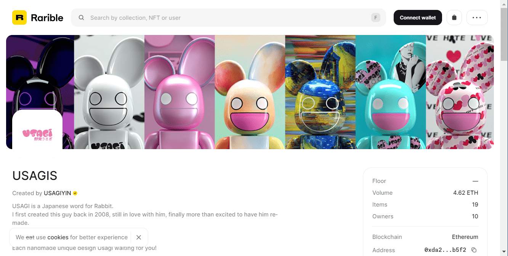

# USAGIS

美国地理信息系统统计
创建于大约 1 年前
111代币供应
10% 费用
过去 7 天没有出售 USAGIS。

已制作 100/100 Usagis。#000 - #099（+ 一些非卖品特别款）

USAGI 是兔子的日语单词。我第一次创造这个人是在 2008 年，我非常喜欢 Kaws、Bape、Madsaki、Bearbrick ......所有这些日本街头和卡通风格，并且受到了很大的影响，这就是我们现在的 Usagi 的方式。仍然爱着他，终于对重拍他感到非常兴奋。

USAGI NFT 收藏品。这是我的个人项目，每件手工制作，总共 100 件。

包括解锁内容，所有者将获得他们的头像、图像等。现在让我们拥有一个独特的Usagi。

