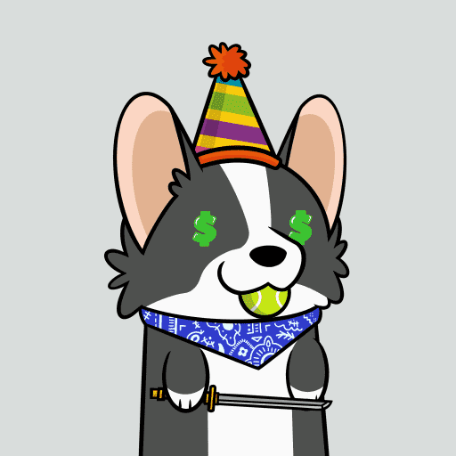

# Utmost Corgi

什么是至尊柯基犬？
Utmost Corgi 是由 333 只独特的 Corgi 组成的集合，它们是由 7 层手绘艺术品元素随机生成的。

与任何其他 Corgi NFT 不同，除了成为有史以来最好和最可爱的 Corgi NFT 之一，我们还以一种稍微不同的方式做事，我们称之为“共享繁荣”。
共享繁荣如何运作？
例如，当某人购买了 Utmost Corgi 时，不仅该人将获得一件独特的艺术品，而且艺术品本身也将成为一张“抽奖”票，每位 Utmost Corgi 所有者也将成为其中的一部分——只要他/她薄荷糖。因此，您有机会获得自己薄荷糖的 10% 现金返还，以及获得他人每次购买成本的 10%。

为了让它变得更好，将有 4 个里程碑，智能合约将随机选择 5 个所有者来获得整个智能合约余额的 10%。当售出 1k/2k/3k/4k Utmost Corgis 时，就实现了每个里程碑。并且当所有 5k 都被售出时，智能合约将自动选择 1 个随机所有者获得整个智能合约余额的 10%。

