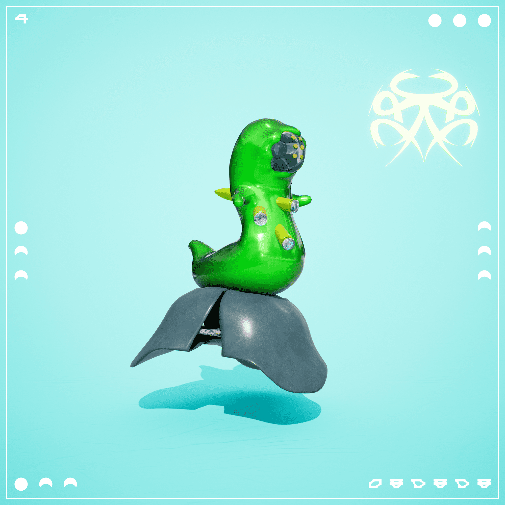

# Vailiens

维林斯统计
创建于 9 个月前
6,327 代币供应
5% 费用
Vailiens NFT 在过去 7 天内售出 1 次。Vailiens 的总销售额为 76.85 美元。Vailiens NFT 的平均价格为 76.8 美元。共有 499 位 Vailiens 所有者，拥有 6,327 个代币的总供应量。

VAIL VR 的 9,000 只生成性组装游戏内宠物的集合，这是一款在线战术射击游戏和虚拟现实社交体验。
▶ 什么是 Vailiens？
Vailiens 是一个 NFT（不可替代令牌）集合。存储在区块链上的数字艺术品集合。
▶ 有多少 Vailiens 代币？
总共有 6,327 个 Vailiens NFT。目前，499 位所有者的钱包中至少有一个 Vailiens NTF。
▶ 最昂贵的 Vailiens 销售是什么？
出售的最昂贵的 Vailiens NFT 是 Arix 1266。它于 2022 年 6 月 19 日（2 个月前）以 241.5 美元的价格售出。
▶ 最近卖出了多少万灵？
过去 30 天内售出了 8 个 Vailiens NFT。

