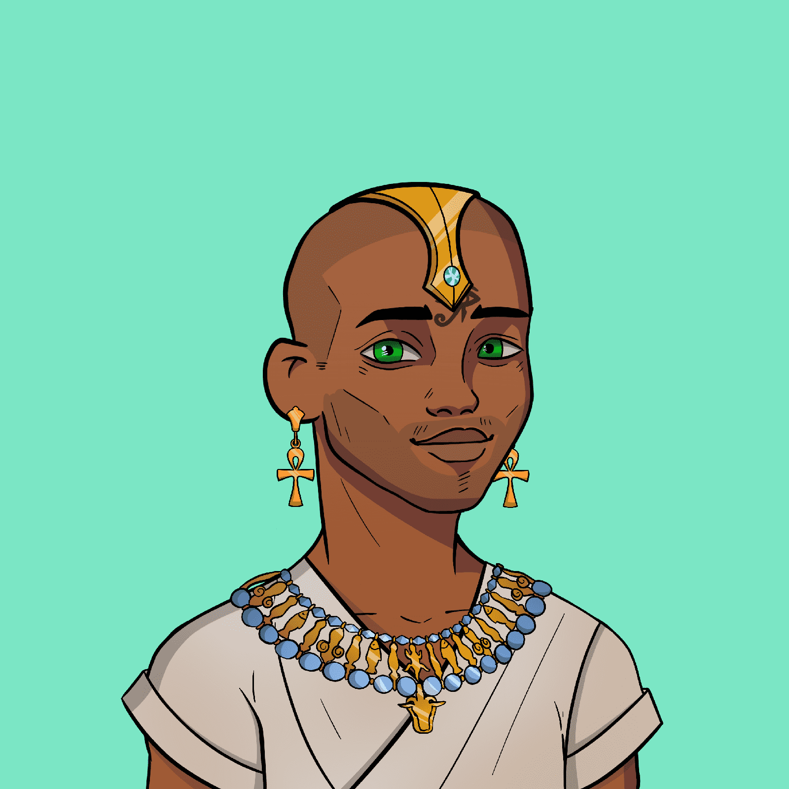

# Valley of the Kings Official

VotK 是 5000 个以埃及为主题的 NFT 的集合，其中包含一件事。我们的持有人。当您加入我们时，您就加入了一个志同道合的 NFT 爱好者社区，其唯一目的是创建一个可持续且有趣的项目！Valley of the Kings 是一个面向持有者的项目，专注于提供有趣和有益的 NFT 持有者体验。如果您有任何问题，请加入 discord！我们希望你加入我们。看看我们一些了不起的 VotK 公民.

展示– 网站上线，Discord 向新成员开放，建立我们的草根营销活动。建立- 社区成员通过帮助为社区提供增长和支持来获得古代国王的角色。公开发售——全部收藏将免费向公众提供，最多铸造 2 个 NFT.

