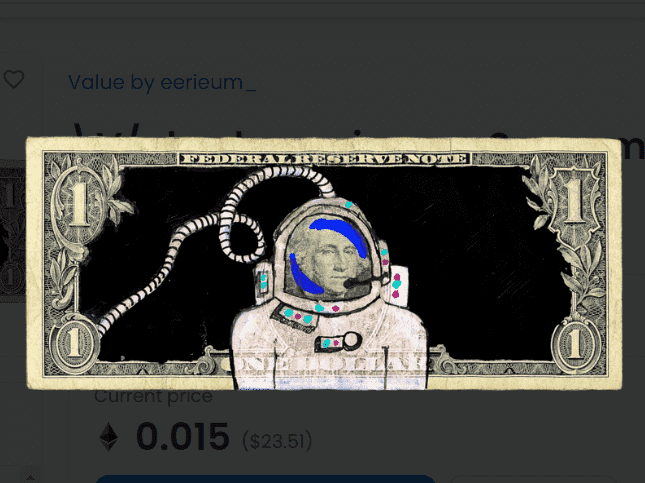

# Value by eerieum_

\V/alue 是 15 岁的洛杉矶街头艺术家 eerieum_ 推出的一款首创的收集赚钱游戏。该项目旨在为喜欢收集金钱、货币、艺术和价值的社区建立共享价值。

这个多阶段的项目将通过多个阶段循环，跨越现实生活和数字体验，并随着世界从物理到数字以及法定到加密的转变，带领收藏家踏上形而上学的旅程。

了解有关 \V/alue 项目的更多信息

“衍生品”系列的前 500 个 NFT 可免费领取（每个钱包限 5 个）。其余 800 个 NFT 的价格为 0.05E，所有销售额的 25% 被发送到包含 Genesis 收藏代币的钱包。

### 什么是“衍生品”？

20 个 NFT 基于组成 \V/alue Project Genesis 系列的 60 个原始手绘“父”代币中的每一个创建。该系列共有 1200 种衍生品。

### 下一步是什么？

eerieum_ 已经开始研究他的下一系列 2 美元的“父级”NFT。衍生品持有者将能够“烧掉”他们的衍生品，以换取更高价值的母代币，这些代币将从未来衍生品的下跌中获得版税。

这个多阶段的项目将通过多个阶段循环，跨越现实生活和数字体验，并随着世界从物理到数字以及法定到加密的转变，带领收藏家踏上形而上学的旅程。

所有创世 NFT 通过访问即将到来的物理和数字投递、IRL 事件和未来的白名单来解锁未来的实用程序。

