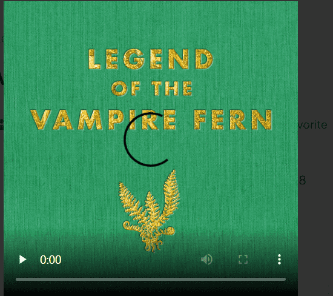

# Legend of the Vampire Fern

吸血鬼蕨的传说是在靛蓝紫色吸血蕨消失之后发生的，这是一种在相机上看不到的超自然植物。不仅如此，蕨类植物对每个看到它的人来说都是独一无二的。来自世界各地的艺术家渲染图让我们深入了解吸血鬼蕨的样子，每件作品都从根本上描绘了历史上最难以捉摸的植物群。当我们继续寻找蕨类植物时，这些效果图可能会很有用。

找到蕨类植物。吸血鬼蕨的传说是一个 NFT（不可替代令牌）集合。存储在区块链上的数字艺术品集合。

