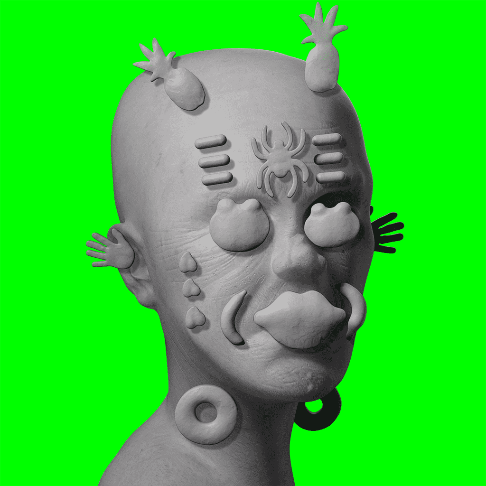

# Van Minion

Van Minion是 Christian Rex Van Minnen 的创世系列，由 51 个 NFT 组成，将在 2021 年末/2022 年初分批拍卖10 个（共 5 次）。该系列中的每件作品都是精美的动画 1/1，描绘了克里斯蒂安对社会内外身份和自我的迷幻沉思。

每一滴也将以 0.1 ETH 的价格解锁 2,000 个“空白”用于公共铸币（限制 5 mints/tx，你这个贪婪的混蛋）。这些空白代表了所有 van Minion 变体的基础形式或“母亲半身像”。每一滴都会有一个新的空白，总共有 5 个基础形状。

作为一名艺术家，2020 年给我带来了巨大的变化和启示。这个项目融合了我生活中的两个新事物：web3 技术和迷幻药。NFT 技术、去中心化和虚拟世界破坏了我的艺术身份。奇怪的是，或者也许并不奇怪，我通过迷幻疗法收到的信息与这些概念相呼应，同时帮助我接受它们。没有一个，我就无法接受或理解另一个。因此，我有动力去建立社区、帮助他人并以前所未有的方式拥抱变化。

