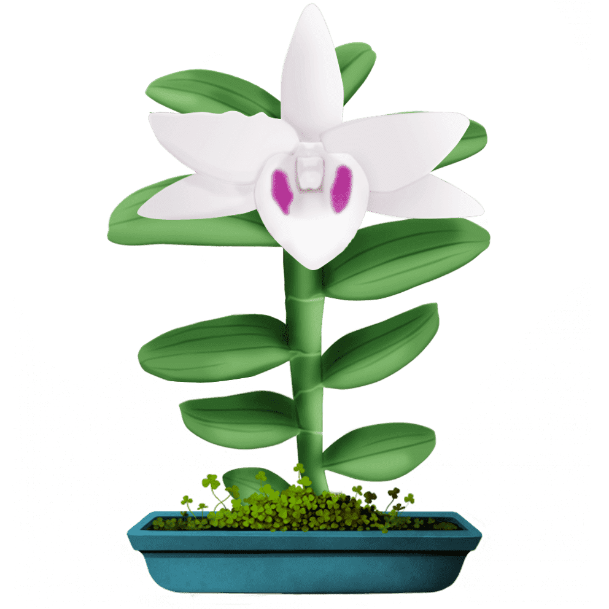

# Varchain

VarChain 是一款网络收藏品游戏，专注于挑选和发现新奇美丽的花式花卉品种。该游戏使用了区块链技术，这就是它被称为 VarChain 的原因。我们这个项目的主要目标是传播有关区块链的信息，并让尽可能多的人可以访问和使用它。VarChain 允许您拥有许多不同类型的兰花，以每天接收可以在交易所交易、买卖的代币。

Varchain 使用 NFT 技术，部署在以太坊的区块链网络上。您从您拥有的兰花树收到的代币数量将每天转移到您的钱包中，您拥有的代币可以在 Pancakeswap、uni 上进行交易，在不久的将来，它可以在其他主要交易所进行交易。您的兰花带来真正的利润！
您可以在 NFT 公海交易所进行兑换、购买、出售、拍卖。

