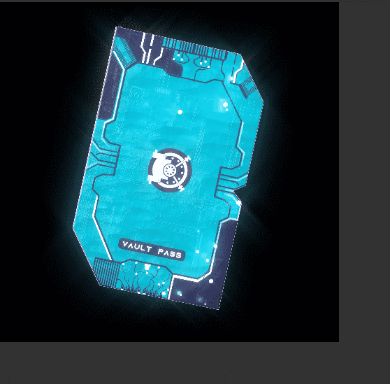

# METAVS Vault Pass

METAV 是一个 2.5D 沙盒和 Web 3.0 平台，内置于浏览器中。该游戏将在所有带有网络浏览器的设备上可用。我们的目标是为基于 NFT 的沙盒游戏创建最简单、无代码的解决方案。METAV 最初是在 2021 年第二季度构建您自己的“口袋妖怪”沙盒。

我们于 2021 年第四季度开始与合作伙伴和影响者分享该项目。随着时间的推移，我们意识到实时编辑器最吸引人。

我们的重点已经转移到基于浏览器的引擎上。我们现在正在构建一个可在所有带有网络浏览器的设备上使用的扩展 2.5D 地图编辑器。

完成后，我们将开始开发社交体验和其他可在使用我们的引擎创建的地图上玩的游戏模式。

社交体验和游戏模式将作为“扩展包”引入。我们的团队将与元通行证/土地所有者一起开发我们自己的游戏活动/事件。

