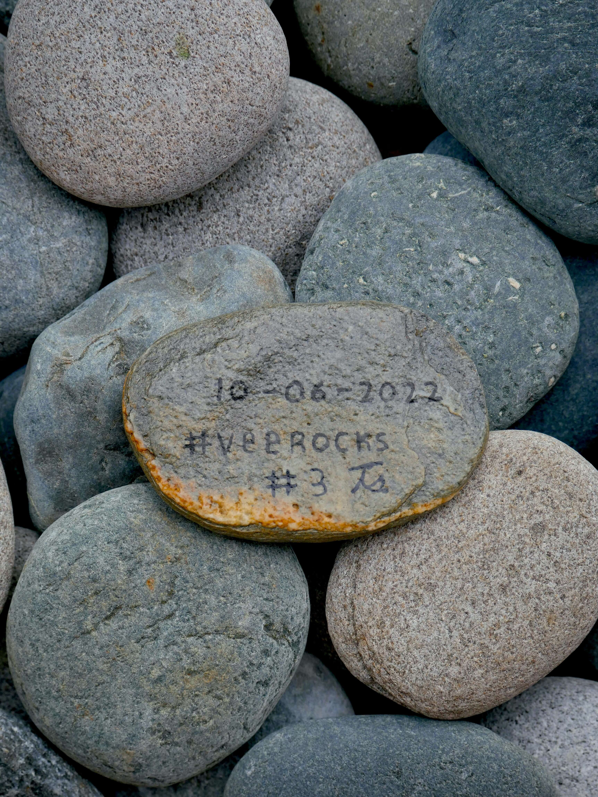

# VeeRocks

VeeRocks 统计数据
创建于 2 个月前
80代币供应
6.5% 费用
VeeRocks NFT 在过去 7 天内售出 1 次。VeeRocks 的总销售额为 11.23 美元。一个 VeeRocks NFT 的平均价格为 11.2 美元。共有 37 个 VeeRocks 所有者，总共拥有 80 个代币。

1/1 手绘岩石！所有权证明！首次发行的 20% 将捐赠给慈善机构！

缩小实体艺术和数字艺术之间的差距。

请检查您的实体艺术品是否已通过 Twitter 上的 DM 认领。

二次销售不附带实物艺术品。
▶ 什么是 VeeRocks？
VeeRocks 是一个 NFT（非同质代币）集合。存储在区块链上的数字艺术品集合。
▶ 有多少 VeeRocks 代币？
总共有 80 个 VeeRocks NFT。目前，37 位所有者的钱包中至少有一个 VeeRocks NTF。
▶ 最昂贵的 VeeRocks 销售是什么？
售出的最昂贵的 VeeRocks NFT 是 VeeRocks #2。它于 2022-07-03（2 个月前）以 11.2 美元的价格售出。
▶ 最近卖出了多少 VeeRocks？
过去 30 天内售出了 1 个 VeeRocks NFT。

