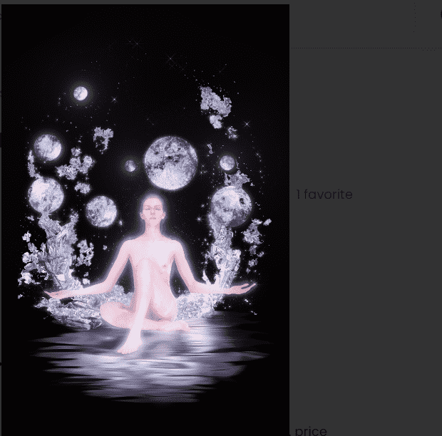

# Venus Diamond Edition

金星钻石版统计
创建于 2 个月前
1 代币供应
0% 费用
金星钻石版 NFT 在过去 7 天内售出 2 次。金星钻石版的总销售额为 65.87 美元。一枚金星钻石版 NFT 的平均价格为 32.9 美元。有 5 位金星钻石版所有者，总共拥有 1 个代币。

“Navaratna”系列的第二颗行星是金星及其对应的宝石 - 钻石。

她迷人的形象——天空中最亮的星球——一直吸引着人们的目光。这颗行星象征着宇宙中最强大的力量——爱的创造能量。

金星被认为是一颗特别仁慈的行星，因为它掌管着人类的感情、快乐、欢乐和美丽。她向来喜欢那些充满爱的人，既有柏拉图式的，也有热情的。

金星化身为美丽的女性，漂浮在明亮的天体之间。她的光环在黑暗的空间中散发出柔和的粉红色光芒。

超然而坚强，又迷人又温柔，金星的形象深深地烙印在脑海中。她催眠观众并且不可能忘记。

