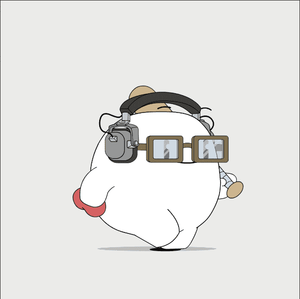

# Verb: Chapter One

6500 个动词，充满活力并准备好拥抱。

Verb 是您最好的朋友最好的朋友，由 Verb Labs 制作。动词是你最好的朋友最好的朋友。当您情绪低落时，动词会接您，并且不怕（不时地）小丑。动词是我们对“动词”这个词的诠释，如果它是一个活生生的、呼吸的、移动的存在。Verb 旨在激发和支持今天的创造者，打造明天的体验。

我们即将推出第 2 章，铸币厂日期将在稍后公布。

