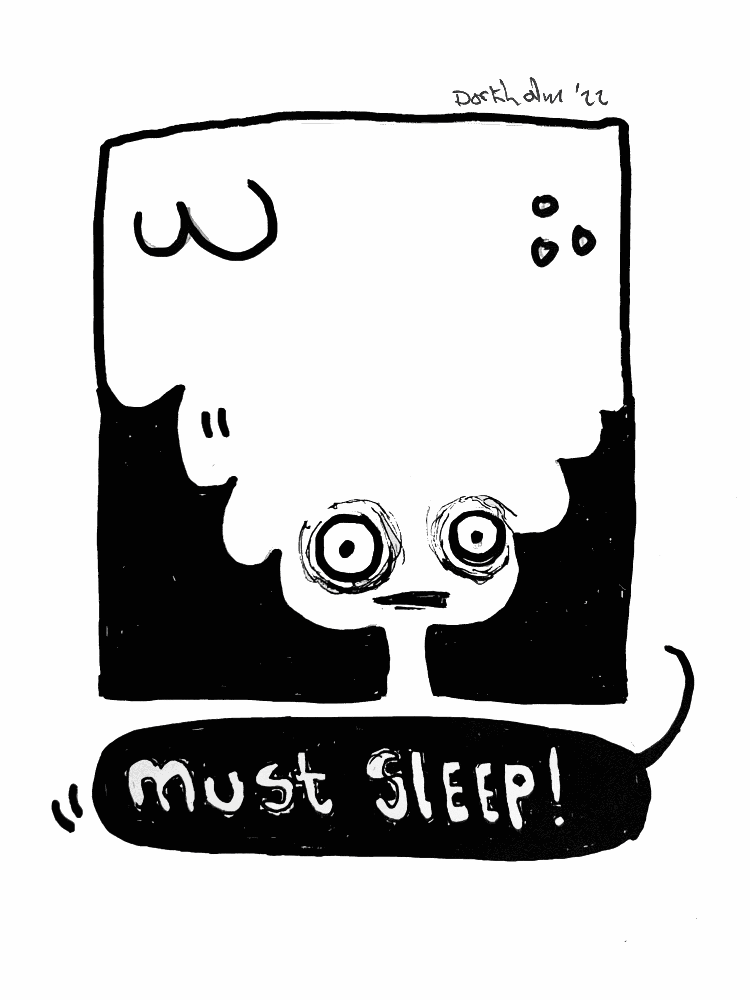

# very bad dork

非常糟糕的傻瓜统计数据
创建于 5 个月前
5 代币供应
10% 费用
在过去的 7 天里，没有卖掉非常糟糕的傻瓜。

他很坏...
非常糟糕的傻瓜 NFT - 常见问题（FAQ）
▶ 什么是非常坏的笨蛋？
非常糟糕的 dork 是一个 NFT（不可替代令牌）集合。存储在区块链上的数字艺术品集合。
▶ 有多少非常糟糕的 dork 代币？
总共有 5 个非常糟糕的 dork NFT。目前 3 位所有者的钱包中至少有一个非常糟糕的 dork NTF。
▶ 最近卖了多少非常坏的笨蛋？
过去 30 天内售出了 0 个非常糟糕的 NFT。

