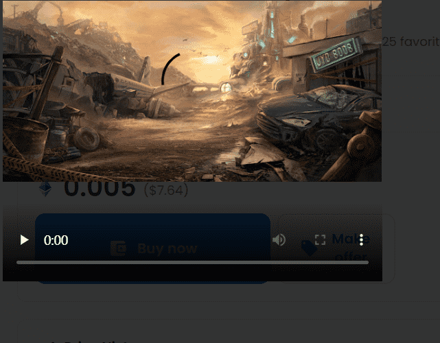

# Views from the Junkyard

您可以在以下各种平台上购买 Junkyard Dogs NFT: OpenSea:JunkyardDogs Collection | OpenSea LooksRare: JunkyardDogs | LooksRare Nifty Gateway: JunkYardDogs I 漂亮的网关
我如何成为“经过验证的狗主人”?
要成为“经过验证的狗持有人”,必须加入 discord 服务器。找到“角色” 部分并进入“collabland-join”频道。点击“走吧!”并按照步骤验证您拥有 Junkyard Dogs NFT。
拥有不止一只垃圾场狗有什么好处吗?
对于您拥有的每条 Junkyard Dog,您将获得更多的 $Junkyard Dollars ($JYD),这是一种 ERC−20 代 币,用于在 JunkYard Dogs 生态系统中购买 NFT。
什么是 SCRAP 和 $JYD?
SCRAP NFT 是一种 ERC–1155 代币,用于在 Junkyard Dog 的市场中制作新的 NFT。它已被称为 $JYD 的新 ERC−20 代币取代。SCRAP 现在可以换成 JunkYard Dollars ($JYD)。请导航到实用程序下拉菜单下的.

