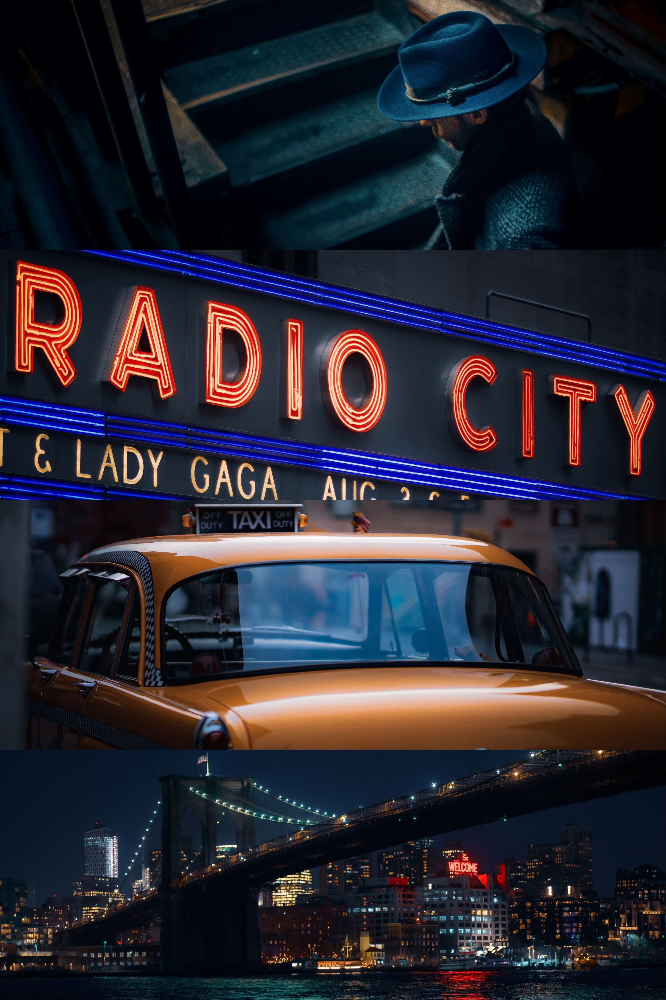

# Vignette City

Erik 是纽约市下东区的一名自由摄影师。虽然他对摄影的热情似乎是他的第二天性，但直到 2015 年他才拿起相机，在那里他以独特的捕捉男性风格的方式迅速赢得了忠实的观众。他曾与许多知名品牌合作，如优衣库、卡地亚、雷克萨斯、GQ 杂志、Le Labo、W 酒店等等。虽然他的职业生涯迅速上升，从迈阿密搬到纽约市，但佛罗里达州的街头摄影激发了他意想不到的一面。他在街头和他周围的人的电影拍摄帮助他迅速赢得了不遵守任何特定领域规则的艺术家的声誉。他可以在城市街道的黑暗角落捕捉浪漫，在灰色单调的世界捕捉纯粹的奇思妙想，

小插曲城市 来自火灾逃生的温暖光芒或当地店主会意的凝视，每个城市居民都带着他们的故事。一个手势背后的情感。在市中心漫步的肆无忌惮的自由，以及在每个人都希望将自己的故事变为现实的城市中存在于数百万人中的悲伤。

每滴将是在@manifoldxyz 上铸造的 10 个版本

价格 0.035 Ξ

售罄后，我将从我的档案中抽出 1/1，以空投给该版本的 10 位收藏家中的 1 位。

每次掉落都是随机的，并且仅在上一版本售罄之后。

现在唯一的问题是，你会收集哪个故事？

