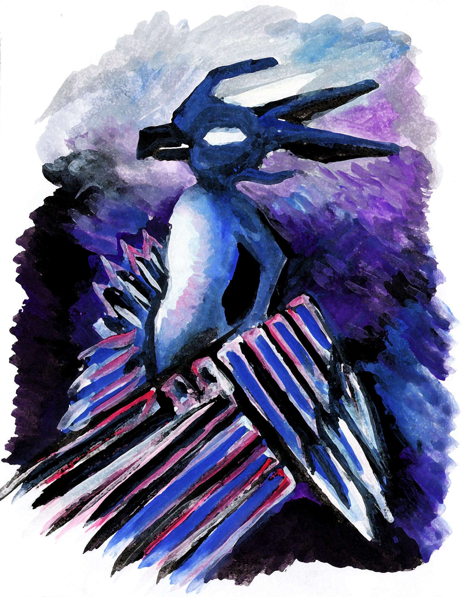

# Viktor Savior Art

Viktor Savior 自 2018 年 1 月起成为虚拟现实艺术家。他在现实中绘画和绘画：肖像、风景、自然、一些抽象艺术。他使用纸、水粉、不同的画笔和调色刀等材料。他的大部分作品色彩鲜艳，充满沉稳的能量和有力的表现力。每张照片背后都有一个独特的故事，并与观众交谈。自 2021 年以来，他使用绘图板并在 Krita 和 PS 中创建数字绘画，混合不同的技术。Viktor 是俄罗斯人（它以他的名义解释了 K，而不是 C）。在现实生活中，他住在以著名陶艺中心而闻名的乌克兰很小的城中村。周围自然环境优美，气候宜人，私人住宅和许多艺术和文化场所，如国家博物馆、陶艺节、传统派对，每个季节都有许多外国客人前来。在全世界都处于困难时期，他想与大家分享他的艺术的积极情绪、快乐和能量。健康快乐。此致，维克托。

