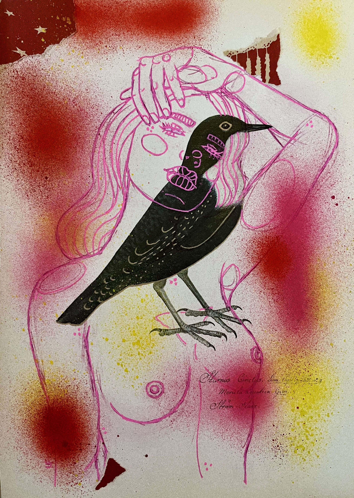

# Vintage Girls ERC-721

出生于 1983 年。总部位于瑞典斯德哥尔摩。
自学成才的艺术家，童年痴迷于漫画女孩。一个画女人的女人——用女性的目光创造新的原型。 

影响包括 Alphonse Mucha、Modesty Blaise 漫画书、Gustav Klimt、John Bauer 和 Elsa Beskow。
“Lisas 的作品是后女权主义的，非常个人化。它将自豪的女性美的当代个人形象叠加在历史刻板的女性文献之上，将它们并列并重绘。温柔、美丽的破坏行为。”
/复古女孩
2015 年 4 月，我制作了我的第一个 Vintage Girl。这是一个需要一定大小的委托，而我的页面非常适合它。

我探索心理健康、创伤和美丽等主题。
老式杂志页面上的混合媒体拼贴画。

我的艺术中有很多文字，我可以在背景中编织一些秘密和故事。我的大部分杂志都来自旧的（1890 年代至 1960 年代）女性杂志。他们中的一些人——比如伊顿——当时被认为是女权主义者，但现在已经过时了。

