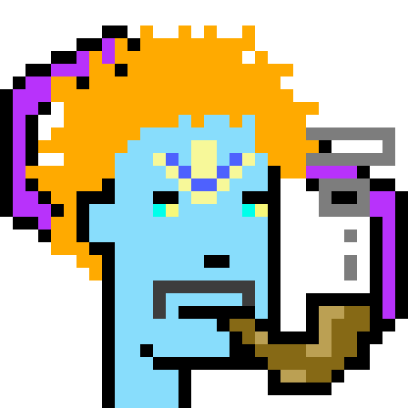

# Virtual Connect Punks

愿景和路线图
Nftkle 计划于 2021 年 9 月从 Klminjeongeum 开始，到 2022 年中期将使用各种区块链创建艺术品（文本、2d、3d）。

klminjeongeum 代币持有者有机会将代币用于新推出的项目白名单。 （如果这个服务不基于klaytn，会换成另外一个链token）
从 2021 年 10 月的 time reco 项目开始，“网络服务”联动开始，该服务是使用区块链技术的横幅广告。
该系统将于 2022 年更新。
Nftkle 习惯使用游戏、AR、VR 等元界技术，
然后计划在 2022 年~2022 年末使用 NFT 制作“网页游戏”和“应用服务”。
在测试了元界联动的可用性和2022年底搭建平台的可能性后，如果可能的话，计划在2023年~2024年1月建成区块链和元界互联服务
nftkle 有可能发行自己的 erc20 代币。
我们计划使用以太坊或其他基于以太坊的主网创建与元界相关的服务。

nftkle 主要专注于元界技术并训练使用区块链构建技术能力。

