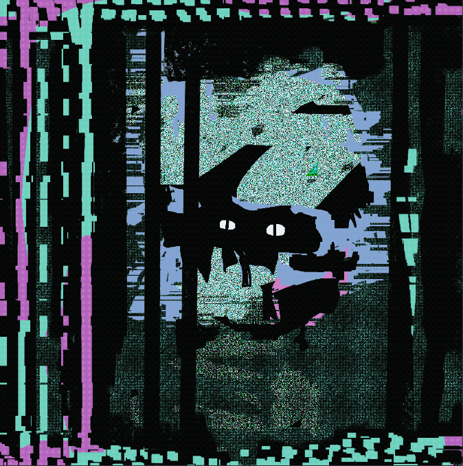

# Virtuoso Creation

大师创作统计
创建于 3 个月前
6 代币供应
10% 费用
过去 7 天没有售出 Virtuoso Creation。

Virtuoso 的版本...
▶ 什么是大师级创作？
Virtuoso Creation 是一个 NFT（非同质代币）集合。存储在区块链上的数字艺术品集合。
▶ 存在多少 Virtuoso Creation 代币？
总共有 6 个 Virtuoso Creation NFT。目前，16 位所有者的钱包中至少有一个 Virtuoso Creation NTF。
▶ 最昂贵的 Virtuoso Creation 拍卖会是什么？
售出的最昂贵的 Virtuoso Creation NFT 是 Right Click Terror。它于 2022-06-09（3 个月前）以 91 美元的价格售出。
▶ 最近卖出了多少 Virtuoso Creation？
过去 30 天内售出了 8 个 Virtuoso Creation NFT。
 交互式 NFT 项目

