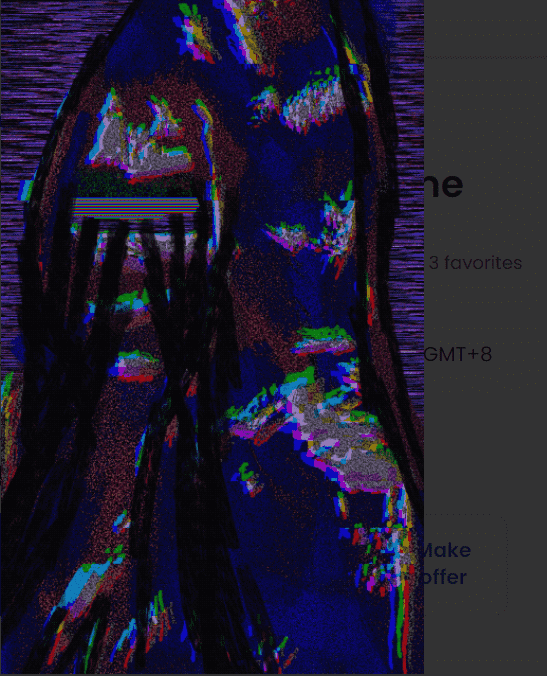

# Virtuoso World

Virtuoso World 统计
创建于 4 个月前
14 代币供应
10% 费用
过去 7 天没有售出 Virtuoso World。

欢迎来到大师的世界。和我一起成为这个旅程的退化者。该系列将有空投，1/1艺术品，多版艺术品。这是我自己与 Manifold 的智能合约。
▶ 什么是大师世界？
Virtuoso World 是一个 NFT（非同质代币）集合。存储在区块链上的数字艺术品集合。
▶ 存在多少 Virtuoso World 代币？
总共有 14 个 Virtuoso World NFT。目前，46 位所有者的钱包中至少有一个 Virtuoso World NTF。
▶ 最昂贵的 Virtuoso World 拍卖会是什么？
售出的最昂贵的 Virtuoso World NFT 是 Hail Degens。它于 2022 年 6 月 9 日（3 个月前）以 364.1 美元的价格售出。
▶ Virtuoso World 最近卖出了多少？
过去 30 天内售出了 14 个 Virtuoso World NFT。
▶ Virtuoso World 需要多少钱？
过去 30 天，Virtuoso World NFT 最便宜的销售额低于 29 美元，最高销售额超过 364 美元。过去 30 天内，Virtuoso World NFT 的中位数价格为 145 美元。

