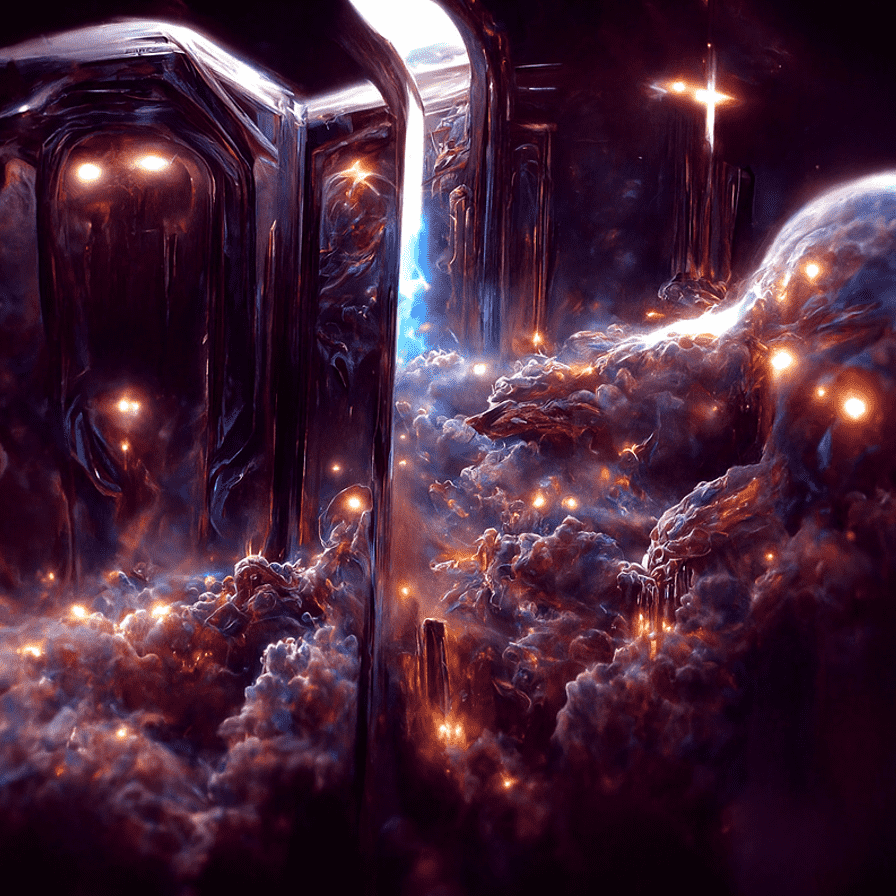

# Visions From the Other Side Series 1

我们的计划和愿景
在一段时间内总共推出 6,666 个 NFT。
NFT 将分三个阶段发布

1,111 个基于跨维度网关愿景的 NFT

2,222 个基于多维世界愿景的 NFT

3,333 个 NFT [未披露]

每个系列的 NFT 持有者将在发布时自动将下一个系列的 NFT 空投给他们。

我们的最终目标是在所有系列都在区块链上发布后，为我们的持有者之一提供“一生的礼物”。

跨维度网关的愿景
该系列基于星际种子在数个生命周期中用于跨越维度到达包括地球在内的多个星系和行星的网关愿景。这些通道的出口点可以在整个地球的能量区找到。一个例子是秘鲁的 Puerta de Hayu Marca。在您享受艺术的同时，我们希望这个系列能激发您开放的胸怀，深入挖掘，发现已失传数百年的古代奥秘。

