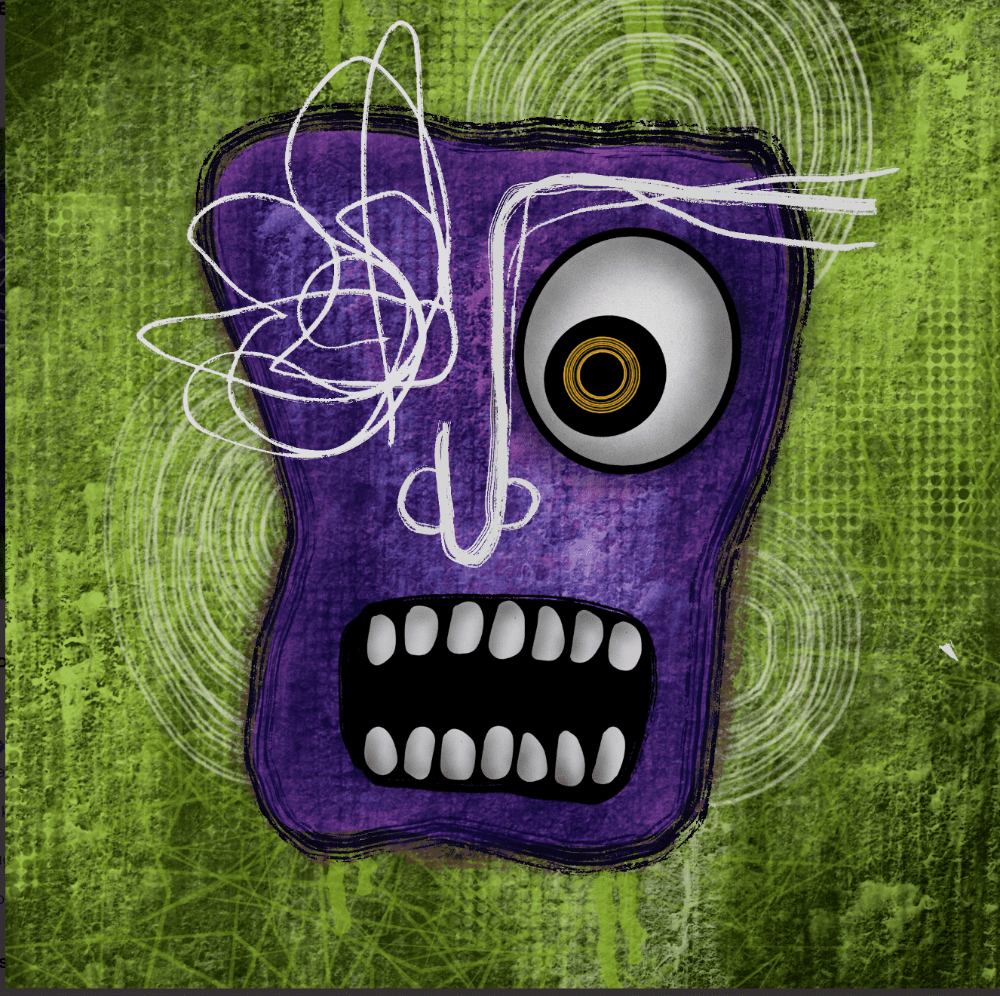

# Vissyuga

Vissyuga 是 Ikari 面孔的年龄 VisithraVissy 是我的昵称，而后面的三个字母具有双重含义。在泰米尔语/梵语中 - Yuga 的意思是年龄或一段时间。请访问 了解有关该系列的信息。Visithra Manikam 是来自马来西亚的多学科视觉艺术家，他创作表现主义和流行超现实主义绘画。她有两种风格，ikari和ikigai。她的艺术作品曾在洛杉矶、纽约、印度、日本、韩国、印度尼西亚、菲律宾等地展出。主要收藏 Visithra -ra 110 eth volume tradedLetters from Visithra  .io/collection/lettersvisithraVissy*请注意，对本 NFT 的所有权并不表示对内容的商业权利的所有权

