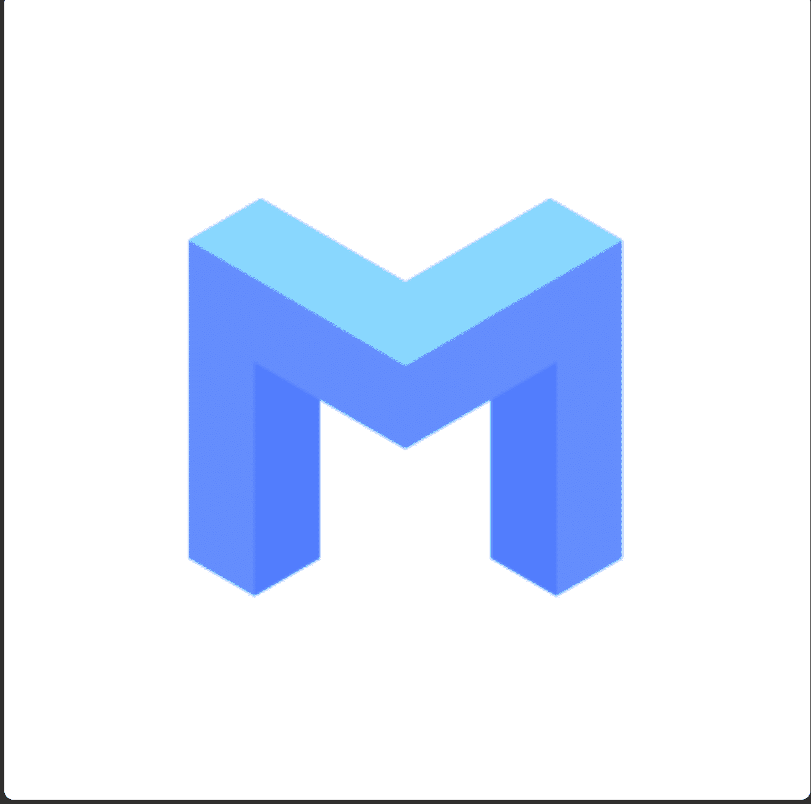

# VME-META-PASS

ABCMETA-PASS是空投接收的Ticket。您可以在

ABCMETA.io是一个NFT资产铸造和交易的全球平台，项目提供“Bid-to-Earn”拍卖模式，是进入元界的全新入口。

参与“USDA流动性挖矿”的参与者将获得USDT的奖励。

参与者还将获得 10 个免费铸币厂 ABCMETA-ID，一个像素化的 NFT，并享受永久版税。

只需伸出手进入 ABCMETA。▶ 什么是 VME-META-PASS？
VME-MET-PASS 是一个 NFT（Non-fungible token）集合。在区块链上的数字收藏品存储集合。
▶ 有多少个VME-META-PASS代币？
VME-PASS有一个META-PASS N个。目前，5、999位-的一个钱包中至少有一个。
▶ 最贵的 VME-META-PASS 销售是什么？
出价最贵的 VME-META-PASS NFT 是 AIRDROP-PASS（5,000 USDT）。它于 2022-06-27（2 个月前）以 4.4 美元的价格售出。
▶最近最接近了多少个VME-META PASS？
过去 30 款 NFT- 认购 1 款 VME N-PASS。

