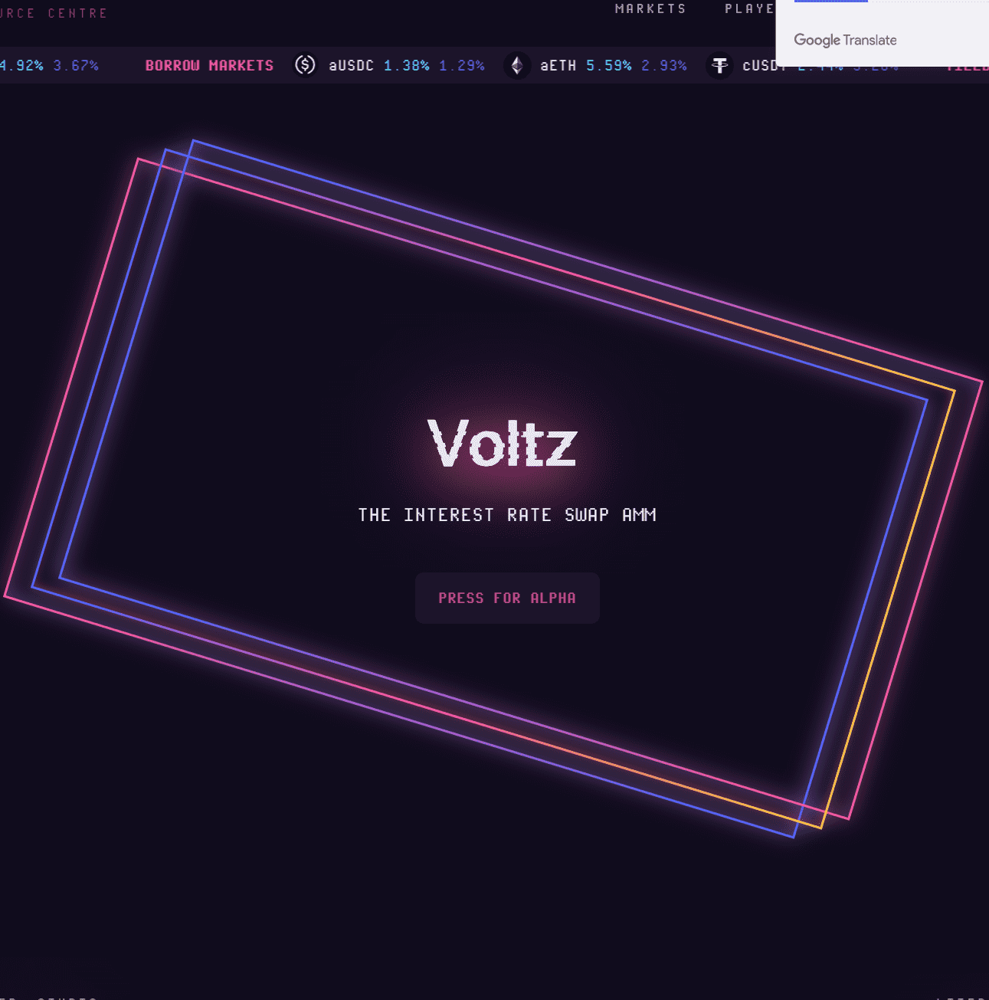

# Voltz Genesis NFT

去中心化。合成的。高效的。
Voltz 是一种新颖的 defi 原语，为杠杆利率掉期提供动力。 Voltz AMM 是有史以来第一个合成利率掉期 AMM，利用集中的流动性，创造了一个资本效率高出约 3000 倍的市场。Voltz 是基础性的 defi 基础设施，为建设者、创新者和创造者释放了一波可组合的、社区主导的机会。加入以 Voltz 为基础的不断壮大的黑客、创新者和开发者社区。加入我们，让我们在 Defi 世界中有所作为。

