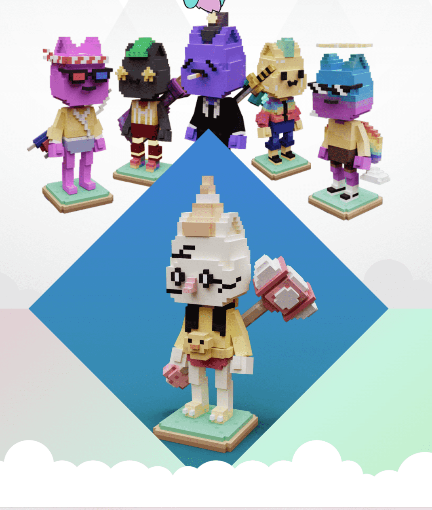

# VOX Coodles

VOX Coodles 是由 Coodles 打造的 10000 个代表沙盒游戏化的团队打造的 10000 个 3D VFT Coodle Avatar Avatar N 的集合。获得 VOXEL NFT 系列 Metaverse 世界提供即时福利优势。持有者相关者还提供了一个令人制作的沙盒实用程序，同时制作了一个可爱的 Metaverse 化身模型，沙盒可以通过其他方式与沙盒合作。赚取活动产生最佳结果！▶ 什么是 VOX Coodles？
VOX Coodles 是一个 NFT（不可替代令牌）集合。存储在区块链上的数字收藏品集合。
▶ 有多少VOX Coodles代币？
1个，有0个Coodle车10,0个VOX Coodles NFT。目前319主的钱包中至少有一个VOX Coodle NTF。
▶ 最昂贵的 VOX Coodles 销售是什么？
售出最贵的 VOX Coodles NFT 是 VOX Coodle #1253。它于 2022 年 6 月 29 日（2 个月前）以 11 美元的价格售出。

