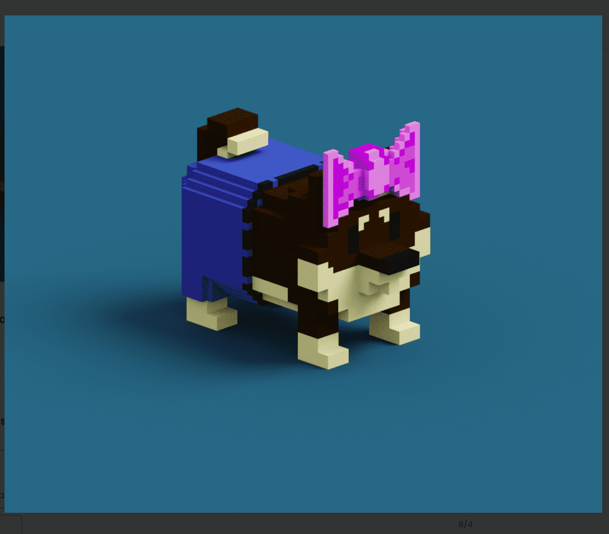

# VoxHoundz

以太坊区块链上 5,000 个独特的基于体素的狗 NFT。每个都是由总共 50 个资产以编程方式生成的。

采用 VoxHound 将授予您终身 VID（非常重要的狗）会员资格。

每个都带有一个可下载的 .obj 文件。这些可以在 Metaverse 中使用，或者您喜欢的任何方式。

您拥有您拥有的每只猎犬的所有商业权利。VoxHoundz NFT - 常见问题（FAQ）
▶ 什么是 VoxHoundz？
VoxHoundz 是一个 NFT（非同质代币）集合。存储在区块链上的数字收藏品集合。
▶ 存在多少 VoxHoundz 代币？
VF有一个NFT1,350个VoxHound。目前，410个Hound的一个钱包中至少有一个NT。
▶最近最接近了多少？
过去30个卖Houndz NFT。

